# 🏛️ Architecture Guide: Personal AI Operating System (AI-OS)

---

## 1. The 7 Concentric Layers

```
┌──────────────────────────────────────────────────────────────────────────────────────────────────┐
│ LAYER 1: CLIENT SURFACES & USER TOUCHPOINTS                                                      │
│  • Next.js 14 Desktop Cockpit (:7701)       • Mobile Companion UI   • Telegram Bridge (@vps_cat)  │
│  • Obsidian Second Brain (LiveSync)         • Command Palette (⌘K)  • Real-Time SSE Streams       │
├──────────────────────────────────────────────────────────────────────────────────────────────────┤
│ LAYER 2: UNIFIED CONTROL PLANE & GATEWAY (forge-control on :7700)                                │
│  • Hono TypeScript REST API (29 Routes)     • Guardrail Pre-flight Engine (evaluateGuardrails)   │
│  • In-Process Cron Scheduler (15s Tick)     • Telegram Poller & Outbound Notification Drain       │
│  • Vault Sync Tick Loop (5m Interval)       • Webhook Ingress Gateway (/webhooks/in/:slug)        │
├──────────────────────────────────────────────────────────────────────────────────────────────────┤
│ LAYER 3: CONCURRENT RUN ENGINE & SUPERVISION (forge-executor)                                    │
│  • Atomic Skip-Locked Claim Loop (Postgres) • Dynamic Concurrency Semaphore (agent.spawn_cap)   │
│  • Headless Claude Code CLI Runner (JSONL)  • Session Persistence & Resume Handling               │
│  • In-Memory Context Compressor             • Memory Prefetch Lane Injection                      │
│  • Manager Loop: HCP Mirror, 90s Stuck Watchdog, Reminder Tick, Deterministic Project Tick       │
├──────────────────────────────────────────────────────────────────────────────────────────────────┤
│ LAYER 4: MULTI-AGENT CODING & DEV ORCHESTRATION                                                  │
│  • Git Worktree Isolation (/opt/ai-os/worktrees) • Round-Based State Machine (R0→R1→R2)          │
│  • Subagent Roles (Architect, Planner, Scout, Builder, Reviewer)                                 │
│  • Model Tiering: Fast (Haiku) / Standard (Sonnet) / Flagship (Opus 4.8)                        │
│  • Adversarial Review Verification & Fix Cycle Loop (Up to 3 iterations)                         │
├──────────────────────────────────────────────────────────────────────────────────────────────────┤
│ LAYER 5: TOOL REGISTRY, SKILLS & MCP SUBSYSTEM                                                   │
│  • forge-control-mcp Stdio Server (Exposing memory.search, memory.note, memory.list)             │
│  • Curated Skill Library (90+ Skills: Hermes, UI/UX, Remotion, Playwright, Browser Automation)   │
│  • External MCP Servers: GitHub, Context7, Playwright, Chrome DevTools, PostgreSQL, Docker, etc. │
├──────────────────────────────────────────────────────────────────────────────────────────────────┤
│ LAYER 6: HYBRID MEMORY, GRAPHRAG & KNOWLEDGE ONTOLOGY                                            │
│  • Closed 8-Category Triple Ontology (decision, rule, error, provider, job, format, person, other)│
│  • Vector Store (pgvector halfvec(1024) + HNSW Cosine Index)                                     │
│  • Multi-Hop Graph Traversal Engine (0.65 Geometric Score Decay per Hop)                          │
│  • 3D Luminescent Graph Visualizer (WebGL / Three.js / UnrealBloom)                              │
├──────────────────────────────────────────────────────────────────────────────────────────────────┤
│ LAYER 7: SUBSTRATE INFRASTRUCTURE & SUPERVISION                                                  │
│  • Hetzner Cloud VPS (Ubuntu Linux, Dedicated Hardware)                                          │
│  • PM2 Process Supervisor (forge-control, forge-executor, forge-control-web)                      │
│  • PostgreSQL 16 (content_forge + hcp), Redis (BullMQ Queues), CouchDB (LiveSync)                │
└──────────────────────────────────────────────────────────────────────────────────────────────────┘
```

---

## 2. Multi-Agent Dev State Machine (`project-tick.ts`)

```mermaid
stateDiagram-v2
    [*] --> ProjectCreated: Operator defines Project Brief

    state ProjectCreated {
        [*] --> CreateWorktree: Provision /opt/ai-os/worktrees/<id>
        CreateWorktree --> SeedRound0: Seed Task R0 (Architect)
    }

    state Round0_Architect {
        [*] --> SpawnArchitect: Spawn Claude Code (Opus / Flagship)
        SpawnArchitect --> GeneratePlan: Produce PLAN.md
        GeneratePlan --> SeedBuilderTasks: Seed Round 1 Tasks with Model Tiers
        SeedBuilderTasks --> R0Complete: Architect Task = 'done'
    }

    ProjectCreated --> Round0_Architect: projectTick claims R0

    state Round1_Builders {
        [*] --> SpawnBuilders: Parallel Execution in Worktree
        state "Parallel Builder Subagents" as Builders {
            BuilderA: Builder 1 (Sonnet / High Effort)
            BuilderB: Builder 2 (Sonnet / Medium Effort)
        }
        SpawnBuilders --> Builders
        Builders --> CodeEdits: File edits, typecheck & test suite
        CodeEdits --> GitCommit: Commit to isolated work_branch
        GitCommit --> R1Complete: All Builder tasks = 'done'
    }

    Round0_Architect --> Round1_Builders: projectTick promotes R1

    state Round2_Reviewer {
        [*] --> SpawnReviewer: Spawn Reviewer (Sonnet, Read-Only)
        SpawnReviewer --> DiffInspection: git diff main...HEAD
        DiffInspection --> EmitVerdict: Strict syntax evaluation
    }

    Round1_Builders --> Round2_Reviewer: projectTick promotes R2

    state VerdictDecision <<choice>>
    EmitVerdict --> VerdictDecision

    state FixCycleLoop {
        [*] --> CheckLimit: fix_cycle < 3?
        CheckLimit --> CreateFixTasks: Yes -> Seed Builder R(N+1) & Reviewer R(N+2)
    }

    VerdictDecision --> FixCycleLoop: VERDICT: NEEDS_FIXES
    FixCycleLoop --> Round1_Builders: Loop back to Builder

    VerdictDecision --> ProjectBlocked: Max fix cycles exceeded (>=3)
    VerdictDecision --> ProjectPass: VERDICT: PASS

    ProjectPass --> [*]: Auto-merge branch & Notify Operator
    ProjectBlocked --> HumanEscalation: Telegram & Inbox Alert
    HumanEscalation --> [*]
```



---

## 3. Hybrid GraphRAG Retrieval Algorithm (`searchMemoryWithGraph`)

1. **Hop 0 (Vector Cosine Entry)**:
   $$	ext{Hit}_0 = 	ext{TopK}\left( 	ext{knowledge\_embeddings} \iff ec{q}_{	ext{halfvec}} 
ight)$$
2. **Seed Entity Extraction**:
   Extracts `subject_key` and `object_key` associated with chunk coordinates `(source_path, chunk_index)`.
3. **Hop 1 & Hop 2 Graph Expansion**:
   Executes recursive relational expansion across `knowledge_triples` filtered by the 8-category ontology.
4. **Geometric Decay Scoring**:
   $$	ext{Score}_{	ext{hop}} = 	ext{Score}_{	ext{base}} 	imes (0.65)^{	ext{hop}}$$
5. **Context Block Injection**:
   Formats highest-ranked knowledge triples and raw text snippets into a `[MEMORY]` block prepended to agent prompt.

---

## 4. Concurrency Semaphore & PM2 Watchdog Loop

```mermaid
flowchart TD
    subgraph PM2 ["PM2 Process Supervision"]
        ProcessExecutor["forge-executor (max-memory: 300M)"]
        ProcessControl["forge-control (max-memory: 300M)"]
    end

    subgraph MainClaimLoop ["Execution Drain Loop (POLL_INTERVAL_MS: 1500ms)"]
        StartLoop["Start Execution Cycle"]
        CheckFreeze{"Is Fleet Paused?<br/>(fleet_state.status == 'paused')"}
        GetConcurrency["Query agent.spawn_cap limit<br/>(Default: 4, Max: 16)"]
        CheckHeadroom{"inFlight.size < limit?"}
        ClaimRun["Atomic Claim Run<br/>(SELECT ... FOR UPDATE SKIP LOCKED)"]
        SpawnProcess["inFlight.set(run.id, processRun())"]
    end

    subgraph RunPipeline ["processRun() Execution Pipeline"]
        PreFlightGuard["Evaluate Guardrails<br/>(Daily / Per-Run Spend Caps)"]
        GuardCheck{"Guardrail Passed?"}
        MemoryPrefetch["Prefetch Memory<br/>(Vector + GraphRAG Hits)"]
        CheckEngine{"Engine Selected?"}
        SpawnCC["Spawn Claude Code CLI<br/>('claude -p' JSONL stream)"]
        StreamEvents["Stream stdout events -> appendThreadEntry()<br/>(tool_call, tool_result, assistant_text)"]
        HeartbeatLoop["Heartbeat Timer (every 5s)<br/>UPDATE runs SET last_heartbeat_at=now()"]
        RunOutcome{"Run Status?"}
        MarkComplete["completeRun('completed')<br/>Save session_id & spend_log"]
        MarkStuck["completeRun('stuck')<br/>Append stuck_notice (Resumable)"]
        MarkFailed["completeRun('failed')<br/>Log error details"]
        NotifyPush["notifyRunOutcome()<br/>Push to Telegram if source in (telegram, cron)"]
    end

    subgraph ManagerLoop ["Parallel Manager Loop (every 10s)"]
        ManagerTick["1. managerTick()<br/>Mirror HCP Escalations -> inbox_items"]
        WatchdogTick["2. stuckWatchdogTick()<br/>Flip stale running (>90s) -> stuck"]
        ReminderTick["3. reminderTick()<br/>Deliver due reminders -> Inbox & Telegram"]
        ProjectTick["4. projectTick()<br/>Promote & reconcile coding project tasks"]
    end

    StartLoop --> CheckFreeze
    CheckFreeze -->|Yes| SleepFreeze["Sleep 5s"] --> StartLoop
    CheckFreeze -->|No| GetConcurrency
    GetConcurrency --> CheckHeadroom
    CheckHeadroom -->|No| SleepPoll["Sleep 1.5s"] --> StartLoop
    CheckHeadroom -->|Yes| ClaimRun
    ClaimRun -->|No run found| SleepPoll
    ClaimRun -->|Run claimed| SpawnProcess
    SpawnProcess --> PreFlightGuard

    PreFlightGuard --> GuardCheck
    GuardCheck -->|Blocked| RecordTrip["Log guardrail_trips & Push Alert"] --> MarkFailed
    GuardCheck -->|Allowed| MemoryPrefetch
    MemoryPrefetch --> CheckEngine
    CheckEngine -->|claude-code| SpawnCC
    SpawnCC --> StreamEvents
    SpawnCC --> HeartbeatLoop
    StreamEvents --> RunOutcome

    RunOutcome -->|Success| MarkComplete
    RunOutcome -->|Timeout (>600s)| MarkStuck
    RunOutcome -->|Error| MarkFailed
    MarkComplete --> NotifyPush
    MarkStuck --> NotifyPush
    MarkFailed --> NotifyPush

    ProcessExecutor --> MainClaimLoop
    ProcessExecutor --> ManagerLoop
```
