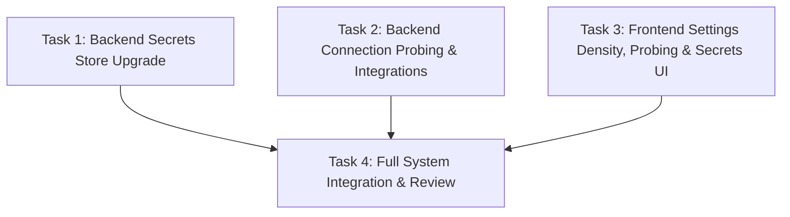

# PLAN: Settings Density, Connections That Probe & Connect, and Encrypted Secrets Store

**Project:** `aios-settings-and-secrets`  
**Project ID:** `b3e148b2-f40c-4353-a811-23891d95918d`  
**Worktree:** `/opt/ai-os/workspace/projects/b3e148b2-f40c-4353-a811-23891d95918d`  
**Date:** 2026-08-23  

---

## 1. Recommendation First

1. **Eliminate Settings Dead Space & Default Directly to Connections:** Remove the empty Depth 0 index void (which leaves 85% of the screen blank). Opening Settings immediately renders the high-density **Connections** surface, with immediate one-click navigation between `CONNECTIONS`, `SECRETS`, and `USAGE & QUOTA` in the persistent left sub-rail.
2. **Actionable Probing with Inline Triggers:** Add an inline `⚡ Probe` / `Test` button to **every** connection row header so Konrad never has to drill into accordions to verify connectivity. Add a top-level `⚡ Probe All` action that tests all services in parallel. Fix GitHub token resolution to recognize existing vault PATs (`github-pat-konrad`).
3. **Real Connect Flows for Complex CLIs:** Wire `CliAuthConnect` for Antigravity (`agy`) with tmux-driven PTY management, URL scraping, and strict 60s timer UX. Provide in-browser re-auth flow and clear diagnostics for Google Workspace (`setup.py --auth-url`).
4. **Upgrade Secrets Store to Encrypted-at-Rest with Audit Trail:** Upgrade `/opt/ai-os/.secrets/store/` with AES-256-GCM authenticated encryption using a 0600 root master key (`/opt/ai-os/.secrets/.master.key`), transparent legacy migration, metadata tracking (name, bytes, created, updated, last-used, access count, service tag, note, pending), append-only access audit log (`/opt/ai-os/.secrets/audit.log`), and a clean `+ Add Secret` / `Rotate` / `Delete` UI.
5. **Candidate Integrations Roadmap:** Documented in `/opt/ai-os/workspace/audits/connections-candidates.md`, prioritizing Twenty CRM, Telegram Bot Bridge, Obsidian Vault Sync, and GitHub.

---

## 2. Architectural Questions Answered

| Question | Architectural Answer |
| :--- | :--- |
| **What owns state?** | • **Secrets:** `/opt/ai-os/.secrets/store/<name>` (AES-256-GCM ciphertext, 0600 root) + sidecar `.meta` JSON (metadata & service tags) + `/opt/ai-os/.secrets/audit.log` (append-only JSONL log). • **Connections:** `/opt/ai-os/.secrets/status/<id>.json` (0600 root, atomified temp+rename, storing `{ok, identity, detail, checked_at}`). • **CLI Auth Sessions:** In-memory map on `forge-control` tracking live tmux sessions (`cliauth-<provider>-<uuid>`). |
| **What dispatches work?** | • **Manual Probes:** User clicks inline `⚡ Probe` or top-level `⚡ Probe All` → `POST /api/integrations/:id/probe` or `POST /api/integrations/probe-all`. • **Scheduled Rechecks:** `cron-tick` runs `recheckAllConnections()` every 15 minutes (`DEFAULT_CONNECTION_RECHECK_INTERVAL_MS`). • **CLI Auth Broker:** `POST /api/integrations/cli-auth/:provider/start` spawns tmux PTY session; polling captures URL; `submitCode` loads code via 0600 buffer. |
| **What happens on failure?** | • **Upstream Probes:** Failures are recorded as `ok: false` with verbatim HTTP status and response body (`R58`). `renderState` produces `BROKEN` or `UNKNOWN` (if stale >3x interval, `R51`). Never throws 500 on an upstream refusal. • **Secrets Access:** Missing master key or decryption failure throws hard error; access audit log records failed attempts. • **CLI Auth Timeout:** If code is not pasted within 60s, state transitions to `expired`, pane is killed, and UI prompts "Relaunch for fresh link". |
| **How does Konrad see it broke?** | • Connections display real-time colored chips (Green `CONNECTED`, Amber `UNKNOWN`, Red `BROKEN`, Gray `ABSENT`), exact probe age (e.g. "3m ago"), and verbatim upstream error text box in red monospace. • Settings banner highlights total active vs broken connections. • Audit log tracks secret read failures; toast errors display exact failure diagnostics. |

---

## 3. Four Core Pillars of Implementation

### Pillar 1: Settings Density & Navigation
- **`forge-control-web/app/desktop/settings/SettingsSurface.tsx`**:
  - Remove empty `SettingsIndex` void.
  - State defaults to `section: "connections"`.
  - Left rail maintains fast switching: `CONNECTIONS`, `SECRETS`, `USAGE & QUOTA`.
- **`forge-control-web/app/desktop/settings/UsagePanel.tsx`**:
  - Collapse verbose 71-line `ShadowCostNote` into a compact telemetry footnote.
  - Bring quota meters (Anthropic 5h/7d, Gemini Ultra) and time-range charts (24h/7d/30d) immediately to the top.

### Pillar 2: Connections That Probe
- **`forge-control/src/lib/connection-status.ts` & `forge-control/src/routes/integrations.ts`**:
  - Add `POST /api/integrations/probe-all` endpoint to execute all probes concurrently.
  - Update `resolveGithubToken` to look for `github-pat-konrad` and `github-pat` in secret store.
  - Add individual probe routes (`POST /api/integrations/google/test`, `POST /api/integrations/agy/probe`, `POST /api/integrations/github/probe`).
- **`forge-control-web/app/desktop/settings/ConnectionsPanel.tsx` & `integrationCards.tsx`**:
  - Add **`⚡ Probe All`** button to header.
  - Add inline **`⚡ Probe`** button directly on every row head (`conn-head`) with loading spinner.
  - Display verified identity (`konradschrein-star`, `konrad.schrein@gmail.com`) and probe age.

### Pillar 3: Connections That Connect
- **`forge-control/src/lib/cli-auth.ts` & `forge-control-web/app/desktop/settings/CliAuthConnect.tsx`**:
  - Wire `agy` PKCE device flow: bare TUI launch on tmux PTY (width 1000 to prevent URL truncation), URL extraction, 60s countdown timer, code delivery via 0600 buffer, post-exchange probe.
  - Wire Google Workspace re-authentication helper.
  - Maintain Claude Code account registry and failover policies.

### Pillar 4: Secrets Store Upgrade
- **`forge-control/src/lib/secret-store.ts` & `forge-control/src/routes/secrets.ts`**:
  - Key management: `/opt/ai-os/.secrets/.master.key` (32 random bytes, 0600).
  - AES-256-GCM encryption at rest for all secret values (`enc:v1:<iv>:<tag>:<ciphertext>`). Transparent on-read migration for legacy plaintext secrets.
  - Metadata tracking: `name`, `bytes`, `createdAt`, `updatedAt`, `lastUsedAt`, `accessCount`, `serviceTag`, `note`, `pending`, `requestedByRunId`.
  - Audit logging: Append to `/opt/ai-os/.secrets/audit.log` on `put`, `reveal`, `rotate`, `delete`. Values never logged.
  - New endpoints: `POST /api/secrets/:name/rotate`.
- **`forge-control-web/app/desktop/settings/SecretsPanel.tsx` & `app/settings/secrets/page.tsx`**:
  - Refactor into clean native desktop component (remove CSS `!important` hacks).
  - Add **`+ Add Secret`** modal with fields: Name, Masked Value, Service Tag, Note.
  - Scannable table with columns: Name, Service, Size, Last Used / Updated, Pending Badge, Actions (`👁 Reveal`, `📋 Copy`, `🔄 Rotate`, `🗑️ Delete`).
  - Values only fetched via POST reveal and stored ephemerally in React state.

---

## 4. Work Breakdown & Task Dependency Graph

### Task 1: Backend Secrets Store Upgrade (AES-256-GCM, Metadata & Audit Log)
- **Role:** `builder`
- **Tier:** `junior`
- **Workstream:** `main`
- **Depends On:** `[]`
- **Write Set:**
  - `forge-control/src/lib/secret-store.ts`
  - `forge-control/src/routes/secrets.ts`
  - `forge-control/src/lib/secret-store.test.ts`
- **Brief:** Implement AES-256-GCM authenticated encryption at rest with master key file (`/opt/ai-os/.secrets/.master.key`, 0600), transparent on-read migration from legacy plaintext files, metadata tracking (service tag, access count, lastUsedAt, createdAt, updatedAt), append-only access audit log (`/opt/ai-os/.secrets/audit.log`), rotation endpoint (`POST /api/secrets/:name/rotate`), and comprehensive unit test suite in `secret-store.test.ts`.

### Task 2: Backend Connection Probes & GitHub Resolution
- **Role:** `builder`
- **Tier:** `junior`
- **Workstream:** `main`
- **Depends On:** `[]`
- **Write Set:**
  - `forge-control/src/lib/connection-status.ts`
  - `forge-control/src/routes/integrations.ts`
  - `forge-control/src/lib/cli-auth.ts`
  - `forge-control/src/lib/connection-status.test.ts`
- **Brief:** Add `POST /api/integrations/probe-all` endpoint to run all connection probes in parallel. Update GitHub token resolution to recognize `github-pat-konrad` and allow alias/candidate matching. Ensure all probe records land atomically in `/opt/ai-os/.secrets/status/<id>.json` and adhere strictly to R51 (staleness demotion), R57 (never connected without checked_at), and R58 (verbatim upstream errors).

### Task 3: Frontend Settings Density, Row Probes & Secrets UI
- **Role:** `builder`
- **Tier:** `junior`
- **Workstream:** `main`
- **Depends On:** `[]`
- **Write Set:**
  - `forge-control-web/app/desktop/settings/SettingsSurface.tsx`
  - `forge-control-web/app/desktop/settings/ConnectionsPanel.tsx`
  - `forge-control-web/app/desktop/settings/integrationCards.tsx`
  - `forge-control-web/app/desktop/settings/SecretsPanel.tsx`
  - `forge-control-web/app/desktop/settings/UsagePanel.tsx`
  - `forge-control-web/app/settings/secrets/page.tsx`
  - `forge-control-web/app/api-connections.ts`
- **Brief:** Eliminate Depth 0 void in `SettingsSurface.tsx` (default directly to Connections). Add `⚡ Probe All` button and inline `⚡ Probe` triggers to every connection row head with live spinner and status updates. Add `+ Add Secret` modal with service tagging, masked inputs, and rotate/delete actions in Secrets UI. Clean up `SecretsPanel.tsx` embedding hacks. Condense `UsagePanel.tsx` disclaimers.

### Task 4: Full System Integration & Review
- **Role:** `reviewer`
- **Tier:** `junior`
- **Workstream:** `main`
- **Depends On:** `[Task 1 ID, Task 2 ID, Task 3 ID]`
- **Write Set:** `[]`
- **Brief:** Review the complete diff against definition of done: verify TypeScript typechecks (`npx tsc --noEmit` in both packages), verify all unit tests pass, ensure no secret values are logged or exposed, verify probe pass and fail states, and confirm `connections-candidates.md` is complete.

---

## 5. Rejected Alternatives

- *Database-backed secrets in PostgreSQL:* Rejected — values would enter `runs.thread`, DB dumps, and backups. 0600 on-disk AES-256-GCM encrypted store is safer and simpler.
- *External charting library (Recharts/Chart.js) for Usage:* Rejected — adds client-side bundle bloat and breaks lightweight SVG token rendering pattern.
- *Multi-page Settings navigation:* Rejected — keeps settings inside the shell as an integrated OS surface without unmounting sidebar/rails.
- *Storing secrets in environment variables:* Rejected — requires server restarts to rotate and exposes secrets across child processes.
