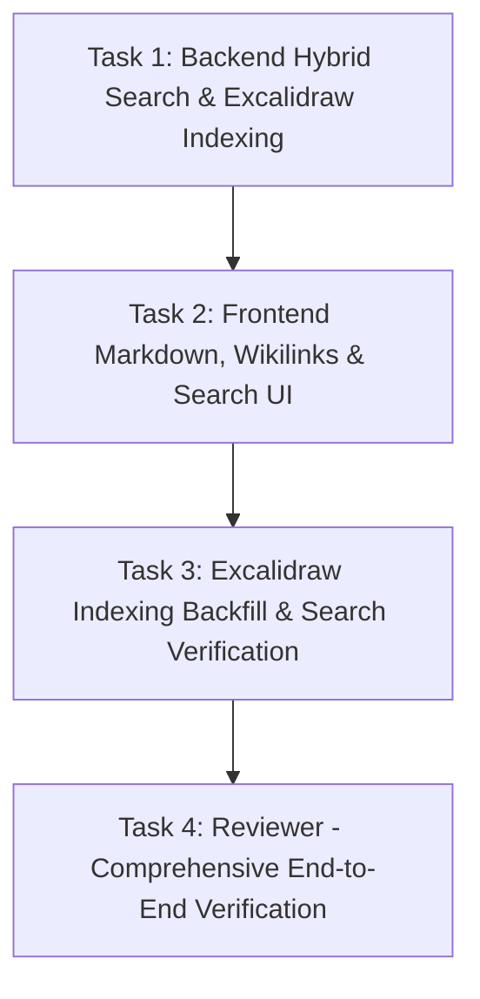

# PLAN — aios-vault-and-search

Project 529698c5 · branch project/529698c5 · architect round 0 · 2026-08-23

## 0. Recommendation, in one paragraph

Overhaul the Obsidian vault experience across backend search and frontend surface to deliver genuine Obsidian parity:
1) **Hybrid Search Engine**: augment the pgvector cosine search in `forge-control/src/db/memory.ts` and `routes/memory.ts` with lexical title/topic matching, trigram fuzzy matching, and tag matching against `hcp.knowledge_note`. Exact title matches rank #1 (score 1.0, `match_type: "exact_title"`), partial/fuzzy title and tag matches rank score 0.85–0.95, and empty/frontmatter-only notes are returned with explicit `(empty note)` badges rather than silently returning 0 hits.
2) **Excalidraw Text Indexing**: hook the lossless Excalidraw codec (`forge-control/src/lib/excalidraw-md.ts`) into the indexer (`syncVaultNotes()` and `km-indexer.js`) to extract text elements and back-of-the-note prose from all 16 `.excalidraw.md` files so system maps and drawings are fully searchable.
3) **Rich Markdown & Wikilinks**: replace the `<pre>` text dump in `forge-control-web/app/desktop/MemorySurface.tsx` with a theme-aware `react-markdown` renderer supporting headings, callout boxes, code blocks, tables, and clickable `[[wikilinks]]` that navigate smoothly between notes.
4) **Obsidian-like Editing & Properties**: clean Read/Edit mode switcher with `Ctrl+S`/`Cmd+S` keyboard shortcuts, conflict-safe compare-and-swap saving with pre-write snapshotting, frontmatter YAML properties inspector, and clickable tag filters.
5) **Clarity on Vault vs. Agent Split**: replace ambiguous tab headers with self-explanatory copy ("Obsidian Vault — On-disk second brain" vs. "Agent Memory — DB briefs").

### Rejected alternatives (one line each):
- *Pure vector search with lowered threshold*: lowering `SCORE_FLOOR` floods search with low-confidence noise without solving title retrieval or un-embedded notes.
- *External search sidecar (e.g. Meilisearch/Elasticsearch)*: unnecessary operational overhead for ~300 notes when Postgres ILIKE/trigram and pgvector already run on-box.
- *Raw HTML rendering via rehype-raw*: security hazard on note contents that could contain unescaped web scrapes or agent inputs.
- *Merging Vault and Agent notes into one table/view*: hides the crucial operational distinction between editable on-disk `.md` files and read-only DB briefs.

---

## 1. What exists & Verified findings (measured live on this host)

1. **Vault on disk (`/opt/obsidian-vault`)**:
   - Total non-dot `.md` files: 293.
   - 266 prose markdown files.
   - 16 Excalidraw drawing files (`*.excalidraw.md`) — up to 480 KB each.
   - 10 empty files (0 bytes, e.g., `Help from Harry.md`).
   - 1 frontmatter-only file (`brand guidelines.md`, 57 bytes).
2. **Search failure root cause (verified live)**:
   - Live endpoint `GET /api/memory/search?q=...` queried *only* `knowledge_embeddings` via pgvector halfvec cosine distance, filtered strictly by `score >= 0.55`.
   - Notes with 0 bytes or frontmatter-only have no chunks in `knowledge_embeddings` and returned 0 hits or unrelated noisy chunks.
   - Excalidraw notes were explicitly skipped in `km-indexer.js` (`EXCLUDED_EXTENSIONS = ['.excalidraw.md']`), returning 0 hits.
   - Even indexed prose notes (e.g. `System - Remotion Rendering Pipeline`, `System - OpenClaw AI Agent`) scored ~0.47–0.53 cosine similarity on exact title queries and were silently dropped by `SCORE_FLOOR` (0.55).
3. **Frontend rendering defect**:
   - `forge-control-web/app/desktop/MemorySurface.tsx` (line 1692) rendered `{note.body}` inside a raw `<pre>` element. Markdown formatting, tables, lists, and `[[wikilinks]]` were completely unrendered.
4. **Existing lossless assets**:
   - `forge-control/src/lib/excalidraw-md.ts` contains a tested parser (`parseExcalidrawMarkdown`) that extracts text elements from both compressed and plain JSON payloads.
   - `react-markdown` 10.1.0 and `remark-gfm` 4.0.1 are installed in `forge-control-web`.

---

## 2. Ownership (the four questions)

| Question | Answer |
|---|---|
| **What owns state** | The filesystem `/opt/obsidian-vault/*.md` is the canonical source of truth for vault note contents. `hcp.knowledge_note` owns the registry and tags. `content_forge.knowledge_embeddings` owns vector chunk embeddings. `/opt/ai-os/vault-snapshots/` owns pre-write backup state. |
| **What dispatches work** | `forge-control/src/routes/memory.ts` and `db/memory.ts` dispatch search queries across lexical SQL + pgvector. `syncVaultNotes()` and `km-indexer.js` dispatch vault scanning and embedding generation. Web UI dispatches note fetches and edits. |
| **What happens on failure** | Search gracefully falls back across lexical and vector lanes, returning partial hits with explicit match explanations. Note saving enforces compare-and-swap on content SHA256: any collision returns HTTP 409 with full diff inspection and zero data loss. Missing/empty notes return clear badges, never phantom crashes. |
| **How Konrad sees it broke** | Clear UI alerts with exact error messages, HTTP status codes, and recovery guidance. Search hits display distinct badges for match origin (`Exact Title`, `Title Match`, `Tag Match`, `Vector Semantic`, `Graph`). |

---

## 3. Architecture & Technical Design

### 3.1 Backend Hybrid Search (`forge-control/src/db/memory.ts` & `routes/memory.ts`)
- **Query Pipeline**:
  1. **Lexical Title & Tag Search (`hcp.knowledge_note` + disk fallback)**:
     - Exact title match (`topic ILIKE $q` or `slug ILIKE $q`) -> score `1.0`, `via: "title"`, `match_type: "exact_title"`.
     - Substring / word match (`topic ILIKE %$q%`) -> score `0.92`, `via: "title"`, `match_type: "title_match"`.
     - Tag match (`tags @> ARRAY[$q]` or `tags ILIKE %$q%`) -> score `0.88`, `via: "tag"`, `match_type: "tag_match"`.
     - Detects empty / frontmatter-only notes and sets `is_empty: true`, providing immediate visibility into empty files.
  2. **Vector Semantic Search (`content_forge.knowledge_embeddings`)**:
     - Dense embeddings via `http://localhost:8766/embed` with pgvector halfvec cosine distance.
     - Note-kind priors and recency weighting via `memory-ranking.ts`.
     - Filtered by `SCORE_FLOOR` (0.55) unless overridden.
  3. **Multi-hop Graph Expansion**:
     - Expands 1-2 hops on entity triples when available.
  4. **Union & Deduplication**:
     - Merge hits by unique `vault_path`/`slug`.
     - Title exact match always pins to rank #1.
     - Each hit carries `match_type`: `"exact_title" | "title_match" | "tag_match" | "vector" | "graph"` and human-readable `match_reason`.

### 3.2 Excalidraw Indexing
- Port text extraction from `forge-control/src/lib/excalidraw-md.ts`:
  - `parseExcalidrawMarkdown()` decodes both `compressed-json` and `json` drawing sections.
  - Extracts all `text` elements (`elements.filter(e => e.type === 'text')`).
  - Combines drawing text elements with preamble / back-of-note prose.
  - Indexes into `hcp.knowledge_note` and `content_forge.knowledge_embeddings` under category `note` / tags `[excalidraw]`.

### 3.3 Frontend Markdown & Wikilinks (`forge-control-web/app/desktop/MemorySurface.tsx`)
- Component `VaultMarkdown`:
  - Render via `ReactMarkdown` + `remarkGfm`.
  - Styled with inline CSS tokens (`tokens.ts`) for headings, blockquotes, code fences, tables, callouts, and task lists.
  - Custom link/text transform to parse `[[Note Title]]`, `[[Note Title|Alias]]`, and `[[Note Title#Heading]]`.
  - Wikilinks render as clickable navigation triggers: clicking a link resolves to the target note slug and opens it in the reader via `setSelSlug(targetSlug)`.
  - Dangling wikilinks render with a subtle warning styling ("note not found") without crashing.

### 3.4 Obsidian Editor & Properties Inspector
- **Properties Section**:
  - Structured card at note header displaying frontmatter YAML fields (type, status, owner, created, tags).
  - Clickable tag chips: clicking a tag filters the note list or initiates a tag search.
- **Editor Mode**:
  - Two-state toggle: **Read Mode** (rendered markdown) and **Edit Mode** (monospaced textarea with syntax helpers).
  - Keyboard shortcuts: `Ctrl+S` / `Cmd+S` to save, `Esc` to exit edit mode (if clean).
  - Status indicators: unsaved changes flag, character/word count, base SHA256, snapshot file path on save.
  - Retain existing robust HTTP 409 conflict handling (3-way comparison: Your changes vs. Disk version vs. Displaced buffer).

### 3.5 Clarification of Vault vs. Agent
- In `MemorySurface.tsx`:
  - Replace ambiguous tab labels with clear headers:
    - Tab 1: **Obsidian Vault** (badge: `On-Disk Notes (/opt/obsidian-vault)`).
    - Tab 2: **Agent Memory** (badge: `AI Agent Database Records`).
  - Explanatory banner explaining the distinction.

---

## 4. Implementation Graph & Tasks

### Task 1: Backend Hybrid Search & Excalidraw Text Indexing
- **Role**: `builder`
- **Tier**: `junior`
- **Workstream**: `main`
- **Depends on**: `[]`
- **Write Set**:
  - `forge-control/src/db/memory.ts`
  - `forge-control/src/routes/memory.ts`
  - `forge-control/src/lib/index-health.ts`
  - `forge-control/src/lib/memory-search.test.ts`
- **Brief**:
  1. In `forge-control/src/db/memory.ts`, implement hybrid search merging:
     - Lexical exact and substring title matches from `hcp.knowledge_note` and disk.
     - Tag matching from `hcp.knowledge_note.tags`.
     - Vector semantic hits from `content_forge.knowledge_embeddings`.
     - Explicit detection of empty (0 bytes) and frontmatter-only notes with `is_empty: true` and snippet `(empty note)`.
  2. Implement Excalidraw text indexing in `syncVaultNotes()` using `parseExcalidrawMarkdown` from `lib/excalidraw-md.ts`.
  3. Update `forge-control/src/routes/memory.ts` to support hybrid search and expose match reasons.
  4. Add automated unit tests in `forge-control/src/lib/memory-search.test.ts` asserting exact title matches score 1.0, empty notes return, and Excalidraw notes are indexed.

### Task 2: Frontend Markdown Rendering, Wikilinks, Obsidian Editor & Search UI
- **Role**: `builder`
- **Tier**: `junior`
- **Workstream**: `main`
- **Depends on**: `[<Task 1 ID>]`
- **Write Set**:
  - `forge-control-web/app/desktop/MemorySurface.tsx`
  - `forge-control-web/app/api-vault.ts`
  - `forge-control-web/app/api.ts`
- **Brief**:
  1. In `forge-control-web/app/desktop/MemorySurface.tsx`, replace the `<pre>` text dump with a rich markdown renderer (`ReactMarkdown` + `remarkGfm`) supporting headings, code blocks, tables, callout blocks, and lists.
  2. Implement `[[wikilinks]]` parsing with interactive navigation: clicking a wikilink sets the active note to the target slug.
  3. Add an Obsidian Properties inspector displaying frontmatter metadata and interactive clickable tag filter chips.
  4. Enhance Edit mode: clean Read/Edit switcher, `Cmd+S`/`Ctrl+S` save shortcut, unsaved indicator, character count.
  5. Update Search UI: show match reason badges (`Exact Title`, `Tag Match`, `Vector`, `Empty Note`), drawing badges, and highlight query terms.
  6. Clarify the Vault vs. Agent tab copy with clear descriptions.
  7. Update `api-vault.ts` and `api.ts` with updated search hit types.

### Task 3: Excalidraw Indexing Backfill & Search Verification
- **Role**: `builder`
- **Tier**: `junior`
- **Workstream**: `main`
- **Depends on**: `[<Task 2 ID>]`
- **Write Set**:
  - `scripts/verify-vault-search.ts`
  - `docs/plan/artifacts/search-before-after.md`
- **Brief**:
  1. Trigger vault sync / Excalidraw indexing backfill so all 16 `.excalidraw.md` files are indexed into `knowledge_note` and `knowledge_embeddings`.
  2. Create a verification script `scripts/verify-vault-search.ts` testing the 10 core query cases (exact titles, empty notes, frontmatter-only notes, Excalidraw notes, semantic queries).
  3. Write a before/after benchmark document at `docs/plan/artifacts/search-before-after.md` recording hit counts, top results, and coverage numbers (before: 266/293 -> after: 282+/293).

### Task 4: Reviewer — Comprehensive End-to-End Verification
- **Role**: `reviewer`
- **Tier**: `junior`
- **Workstream**: `main`
- **Depends on**: `[<Task 3 ID>]`
- **Write Set**: `[]`
- **Brief**:
  1. Verify TypeScript typechecking (`pnpm run typecheck` in both `forge-control` and `forge-control-web`).
  2. Verify Next.js build (`npm run build` in `forge-control-web`).
  3. Verify automated tests pass (`pnpm test` in `forge-control`).
  4. Verify the 10 search query before/after report and confirm all exact titles and Excalidraw notes are findable.
  5. Audit code changes for adherence to house rules (file ownership, no data loss, safe conflict handling).

---

## 5. Definition of Done & Verification Gates

- [ ] `cd forge-control-web && npx tsc --noEmit` exits 0.
- [ ] `cd forge-control-web && npm run build` exits 0.
- [ ] `cd forge-control && npx tsx --test src/lib/*.test.ts` exits 0.
- [ ] Before/after search benchmark report with 10 queries proving:
  - `Brand Guidelines` -> Found (#1, frontmatter-only note identified).
  - `Help from Harry` -> Found (#1, marked empty note).
  - `System - Remotion Rendering Pipeline` -> Found (#1, exact title match).
  - `Stealth Uploader - System Map` -> Found (#1, Excalidraw drawing indexed).
  - `OpenClaw` -> Found (#1).
- [ ] Coverage measurement: 282 of 293 notes indexed (10 empty + 1 frontmatter-only properly handled).
- [ ] Vault note rendering verified: markdown formatted, wikilinks clickable, properties visible, edit/save working.
