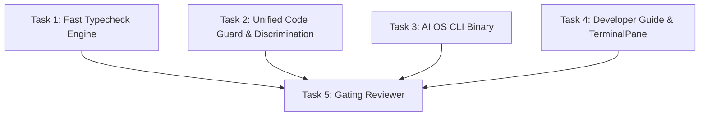

# PLAN — aios-devenv-and-cli

Project `323661ce-7dd5-4b86-ae78-e52d846c42ed` · branch `project/323661ce` · architect round 0 · 2026-08-23

## 0. Recommendation, in one paragraph

Transform the AI OS into a fast, professional development environment by delivering three foundational pillars: (1) **A High-Speed Code Guard** (`scripts/checks/guard.sh`) that executes token purity, static rules, parallelized/cached typechecks, web production build verification, and functional assertions in <15s cold (<2s hot) with strict, actionable failure reporting; (2) **A Comprehensive AI OS CLI** (`aios` / `forge-control/bin/aios.mjs`) wrapping the live `:7700` forge-control API with first-class subcommands (`projects`, `runs`, `tasks`, `vault`, `pipeline`, `spend`, `screenshots`, `terminal`, `guard`), readable `--help`, and `--json` support; and (3) **A Clear Developer Guide** (`docs/DEVELOPMENT.md` and `docs/how-to-develop.md`) documenting worktree protocols, verification procedures, and screenshot capture conventions so parallel agent lanes never re-derive setup or break `main`.

Rejected alternatives (one line each):
- Rebuilding existing check scripts from scratch: rejected because 40+ mature instruments already exist; we unify and accelerate them rather than rewrite them.
- Creating a separate CLI backend or daemon: rejected because `:7700` is the single source of truth; the CLI wraps the live API directly.
- Diff-only typechecking without cache or full fallback: rejected because whole-repo type invariants can break from remote interface changes.
- Skipping web build in pre-merge gates: rejected because Next.js compilation catches `"use client"` and SSR boundary faults that `tsc` misses.

---

## 1. System Architecture & Component Design

### 1.1 Fast Parallel Typecheck Engine (`scripts/checks/check-instrument-typecheck.sh`)
- **Bottleneck Identified:** The legacy check executed `tsc` 44 times sequentially, consuming ~147s on a 16-core VPS while 15 cores sat idle.
- **Solution:** 
  - Parallel worker pool using `xargs -n 1 -P $(nproc)` (or concurrent process batches) across available CPU cores.
  - Persistent content-hash caching (`sha256(content + profile)`) stored in `/tmp/.aios-typecheck-cache/` to skip unchanged files in <1ms.
  - Retain all 5 security/integrity canaries (strictNullChecks TS2322, declaration files TS2717, @types paths, noEmit, suppression scanner) and waiver ledger enforcement.
  - Expected performance: ~12-15s cold, <2s hot.

### 1.2 Unified Pre-Merge Code Guard (`scripts/checks/guard.sh`)
- **Command:** `bash scripts/checks/guard.sh [--fast|--full|--strict|--json]` (also aliased via `pnpm guard` and `aios guard`).
- **Phased Execution Pipeline:**
  1. **Phase 0 — Preflight:** Node version, pnpm devDependencies validation (catches `NODE_ENV=production` pruning with exact remediation advice).
  2. **Phase 1 — Static Rules & Token Purity:** `no-raw-colours.cjs`, `dollar-sweep.sh`, forbidden file diffs (protects core engine files and unowned surfaces).
  3. **Phase 2 — Multi-Target Typecheck:** Concurrent typechecking of `forge-control`, `forge-control-web`, and `scripts/checks/`.
  4. **Phase 3 — Web Build:** Production Next.js build verification (`NODE_ENV=production pnpm build`).
  5. **Phase 4 — Functional Checks:** Non-destructive unit and assertion suites.
- **Reporting & Diagnostics:** Clear tabular summary with pass/fail badges, elapsed time, exact source location (`file:line`), error diagnostics, and suggested fix commands.
- **Negative Control / Discrimination:** Self-test script (`scripts/checks/test-guard-discrimination.sh`) that deliberately injects faults (type error, raw color literal, dollar literal), asserts the guard goes RED, restores code, and asserts GREEN.

### 1.3 Personal AI OS CLI (`aios`)
- **Binary:** `forge-control/bin/aios.mjs` (executable node script with ESM imports).
- **Endpoint Target:** Live `forge-control` API (`http://127.0.0.1:7700` or `$FORGE_CONTROL_URL`).
- **Subcommands:**
  - `projects`: `list`, `show <id>`, `create <title> --brief <text|file>`, `pause <id>`, `resume <id>`
  - `runs`: `list [--project <id>]`, `show <id>`, `message <id> <text>`, `stop <id>`
  - `tasks`: `list --project <id>`, `show <id>`, `create --project <id> --role <role> --title <title> --brief <brief>`, `cancel <id>`
  - `vault`: `search <query>`, `today`, `read <path>`, `append <path> <text>`
  - `pipeline`: `status`, `topics list`, `topics add <brief>`
  - `spend`: `summary`, `breakdown [--since 24h]`
  - `screenshots`: `list [--run <id>]`, `take <surface> [--out <dir>]`, `view <path>`
  - `terminal`: `list`, `create [--title <t>] [--cwd 
]`, `run <cmd>`
  - `guard`: `fast`, `full`, `strict`
- **CLI Ergonomics:** Automatic TTY table formatting, `--json` flag for machine consumption, comprehensive `--help` with examples, actionable error messages pointing to corrective commands.

### 1.4 Developer Documentation & UI Integration
- `docs/DEVELOPMENT.md` & `docs/how-to-develop.md`: SOP for worktree management, dependency setup (`--prod=false`), guard execution, screenshot capture with `shots-aios.mjs`, and merge verification.
- `forge-control-web/app/desktop/TerminalPane.tsx`: Adherence to `app/tokens.ts`, robust keystroke handling, clear live/dead shell indicators, and native integration for running `aios` CLI commands.

---

## 2. Four Operational Questions

1. **What owns state?**
   - The live `forge-control` API (:7700) and PostgreSQL `content_forge` database own OS/project/run/task state.
   - The filesystem and git tree own code and documentation state.
   - `/tmp/.aios-typecheck-cache/` owns ephemeral compiler hash caches.
2. **What dispatches work?**
   - The developer/agent running `./scripts/checks/guard.sh` or `aios guard`.
   - The `forge-control` task scheduler orchestrating background agent runs.
3. **What happens on failure?**
   - `guard.sh` fails loudly with exit 1, prints a structured summary naming the exact failing check, line number, compiler message, and remediation steps.
   - `aios` CLI prints a descriptive diagnostic message and suggests corrective CLI or API actions.
4. **How does Konrad see it broke?**
   - Terminal & Web UI render clear RED exit statuses and error blocks.
   - Reviewer phase blocks merge if `guard.sh --strict` or discrimination tests fail.

---

## 3. Workstreams and Task Graph

### Task Specification

- **Task 1: Fast Typecheck Engine**
  - Role: `builder` | Tier: `junior` | Workstream: `main`
  - Write set: `["scripts/checks/check-instrument-typecheck.sh", "tsconfig.checks-instruments.json"]`
- **Task 2: Unified Code Guard & Discrimination**
  - Role: `builder` | Tier: `junior` | Workstream: `main`
  - Write set: `["scripts/checks/guard.sh", "scripts/checks/test-guard-discrimination.sh", "package.json"]`
- **Task 3: Personal AI OS CLI Binary**
  - Role: `builder` | Tier: `standard` | Workstream: `main`
  - Write set: `["forge-control/bin/aios.mjs", "forge-control/src/lib/cli-runner.ts", "forge-control/package.json"]`
- **Task 4: Developer Documentation & Terminal UI**
  - Role: `builder` | Tier: `junior` | Workstream: `main`
  - Write set: `["docs/DEVELOPMENT.md", "docs/how-to-develop.md", "forge-control-web/app/desktop/TerminalPane.tsx"]`
- **Task 5: Gating Reviewer**
  - Role: `reviewer` | Tier: `standard` | Workstream: `main`
  - Depends on: `[Task 1, Task 2, Task 3, Task 4]`
  - Write set: `[]`

---

## 4. Amendments — round 2 (fix cycle 1), 2026-08-23

Appended, not rewritten: the sections above record what round 0 *planned*, and
nothing in them is edited retroactively. This section records where reality
diverged.

### 4.1 §1.1's performance targets are not met on this host

`PLAN.md` §1.1 promises "~12-15s cold, <2s hot" for
`scripts/checks/check-instrument-typecheck.sh`. Measured on the live VPS on
2026-08-23 at load average 17-26 on 16 cores (i.e. a normal night with ~10
agent lanes running):

| Run | Measured |
|---|---|
| warm cache | 19.4s |
| immediately re-run (fully hot) | 15.5s |
| cold cache | ~91s (round-1 reviewer's measurement, at load 32-47) |

The targets were set assuming an idle machine. Under contention the cost is
dominated by process-start latency — the script's five self-test process
starts alone (3 `tsc` canaries + 2 suppression scanners), which no amount of
caching inside the compile loop can remove. **Treat §1.1's numbers as an
idle-box ceiling, not an acceptance criterion**; `docs/DEVELOPMENT.md` §4
carries the measured table and the instruction to check `uptime` before
calling a slow run a regression.

### 4.2 Write-set disclosure for `scripts/checks/raw-colour-allowlist.txt`

Round 1 wrote `scripts/checks/raw-colour-allowlist.txt` (commit `9cf15e9`),
which appears in none of the five write sets above. Round 2 wrote it again
(pinning the over-broad entry that write introduced).

The round-1 reviewer asked that the path be added to whichever task's write
set owns it. **Declined, deliberately.** The operator has ruled that a task's
declared write set is never amended after the fact ("A ledger you may edit
after the fact stops being evidence", `AI OS/Operator Decisions.md`): the
declared-vs-written gap is the only signal that a collision happened, and
editing the declaration deletes that signal. The undeclared write is disclosed
here and in `WORKLOG.md` instead, which is where disclosures belong.
