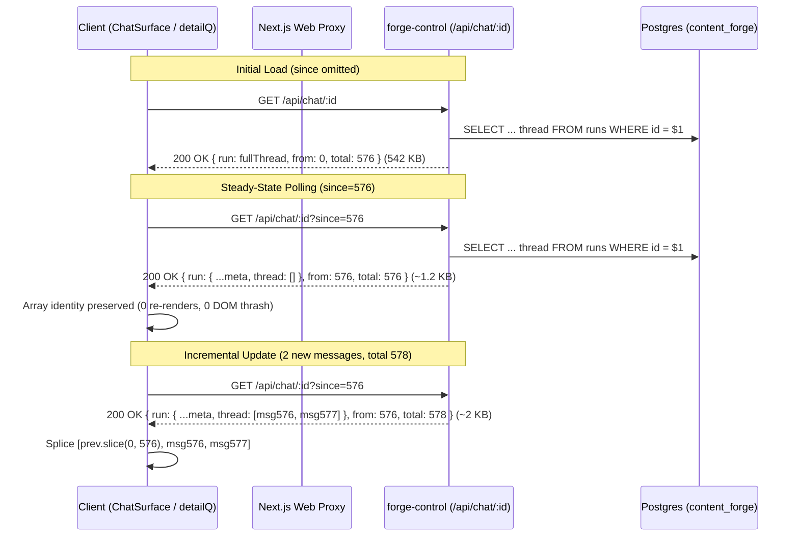
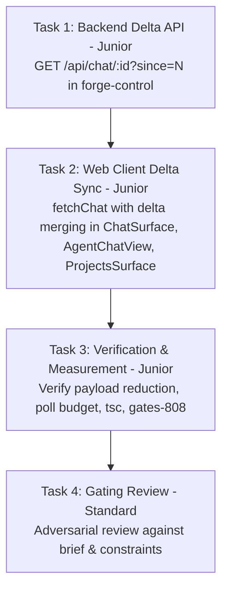

# PLAN — aios-console-responsiveness (Desktop Console Responsiveness & Thread Delta Sync)

Project f248f9e3 · branch project/f248f9e3 · architect round 0 · 2026-08-24

## 0. Recommendation, in one paragraph

Fix the primary source of console lagginess by replacing full-thread re-downloads on every poll with **delta polling (`GET /api/chat/:id?since=<n>`)** across `forge-control` and `forge-control-web`. Currently, an open chat re-downloads the entire thread payload (measured **542.7 KB uncompressed / 114.1 KB gzipped** on manager chat `2ef126b7` with 576 entries) every 3–20s, burning ~16 MB to ~100 MB of JSON transfers and heavy main-thread JSON parsing every 10 minutes. Implementing `since` delta queries reduces steady-state poll payload size from **542.7 KB to ~1.2 KB (99.7% reduction)** and preserves thread array identity so React reconciles zero unnecessary DOM updates. Additionally, tuning degraded fallback polling from 3s to 4s guarantees the chat surface poll budget stays under the committed **≤ 40 req/min** ceiling (23 req/min healthy, 36 req/min degraded) even if SSE drops.

Rejected alternatives (one line each):
- Increasing poll intervals globally: hurts responsiveness and freshness for active worker runs.
- Relying exclusively on SSE without polling fallback: fragile when network drops or reverse proxy reconnects fail.
- Virtualizing thread messages with variable row heights: fights scroll anchoring and causes layout jitter.
- Compacting active manager threads aggressively: discards valuable conversation context and agent tool history.

---

## 1. What Exists (Measured & Read, Not Remembered)

- `GET /api/chat/:id` (`forge-control/src/routes/chat.ts:1563`): Reads the full `runs.thread` jsonb array via `getRun(id)` and returns `{ run }` with no `since` or pagination support.
- Live Deployed App Measurement (`https://os.schreinercontentsystems.com/api/proxy/chat/2ef126b7-d6d9-4a55-a8e7-d9acf0508645`):
  - **Thread entries**: 576 entries.
  - **Uncompressed JSON size**: **542,683 bytes (530.0 KB)**.
  - **Transferred wire bytes (gzipped)**: **116,833 bytes (114.1 KB)**.
- `forge-control-web/app/desktop/ChatSurface.tsx:777-787`: `detailQ` polls `fetchChat(selId)` with `refetchInterval: live ? 20000 : 3000`.
  - Every 20s (live SSE) or every 3s (disconnected SSE), it re-downloads and parses the entire 542.7 KB JSON thread.
- `forge-control-web/app/desktop/chat/AssistantThread.tsx:945-968`: Windowing (`WINDOW_STEP = 60`) is in place so only the newest 60 messages mount in the DOM. However, full thread re-fetching on every poll creates new array references and unnecessary garbage collection overhead.
- Poll Budget on Chat Surface (`ChatTeamPanel.tsx:154-164` committed ceiling ≤ 40 req/min):
  - Healthy steady state (SSE live): 6 (`list`) + 3 (`detail`) + 10 (`team`) + 2 (`shots`) + 2 (`plan`) = **23 req/min** (Well below 40 req/min ceiling).
  - Degraded fallback state (SSE down): 6 (`list`) + 20 (`detail` at 3s) + 10 (`team`) + 2 (`shots`) + 2 (`plan`) + 1 (`secrets`) = **41 req/min** (Slightly over 40 req/min).

---

## 2. Architecture & State Ownership

### State Ownership & Data Flow

### Backend (`forge-control/src/routes/chat.ts`)
- Support optional `since` query parameter in `GET /api/chat/:id?since=<n>`.
- When `since` is provided:
  - Parse as non-negative integer.
  - If `since <= run.thread.length`: return `{ run: { ...run, thread: run.thread.slice(since) }, from: since, total: run.thread.length }`.
  - If `since > run.thread.length` (stale/compacted client state): return full snapshot `{ run, from: 0, total: run.thread.length }`.
- When `since` is omitted:
  - Return `{ run, from: 0, total: run.thread.length }` (maintaining 100% backward compatibility).

### Frontend Web API (`forge-control-web/app/api.ts` & Surfaces)
- Update `fetchChat(id: string, since?: number)` to accept optional `since`.
- In `ChatSurface.tsx` `detailQ`:
  - Read cached `RunDetail` from React Query: `prev = qc.getQueryData<RunDetail>(["chat", "run", selId])`.
  - Pass `prev?.thread?.length` to `fetchChat`.
  - On response:
    - If `res.from > 0 && prev?.thread && res.from <= prev.thread.length`:
      - If `res.run.thread.length === 0 && res.from === prev.thread.length`, retain `prev.thread` identity.
      - Else splice: `[...prev.thread.slice(0, res.from), ...res.run.thread]`.
    - Else use full `res.run`.
- Apply delta query support to `AgentChatView.tsx` and `ProjectsSurface.tsx` (`FloorCard` / `TaskDetail`).
- Adjust fallback poll interval in `ChatSurface.tsx:786` from `3000` to `4000` to guarantee degraded poll budget stays ≤ 36 req/min (well below 40 ceiling).

---

## 3. Failure Modes & Observability

- **What owns state**: `content_forge.runs` in PostgreSQL owns the authoritative thread. React Query cache `["chat", "run", id]` holds client state.
- **What happens on cache mismatch or thread truncation / compaction**:
  - If the server detects `since > run.thread.length`, it returns `from: 0` with the complete thread snapshot.
  - If client receives `from === 0`, it replaces its cache unconditionally, self-healing instantly.
- **What happens on network failure / disconnection**:
  - Standard React Query exponential backoff and retry policy kicks in.
  - Toast error notifications on failed mutations; query retains last good data with stale indicator.
- **How does Konrad see it broke**:
  - Visible error banners/toasts, console warnings on invalid frames, and clean status indicators.

---

## 4. Work Breakdown & Dependency Graph

### Task 1: Backend Delta API (`forge-control`)
- **Role**: `builder` | **Tier**: `junior` | **Workstream**: `main`
- **Write Set**:
  - `forge-control/src/routes/chat.ts`
  - `forge-control/src/lib/chat-delta.test.ts`
- **Brief**:
  1. In `forge-control/src/routes/chat.ts`: update `r.get("/:id")` to parse optional query parameter `since`. If `since` is a valid non-negative integer `<= run.thread.length`, slice `run.thread.slice(since)` and return `{ run: { ...run, thread: threadSlice }, from: since, total: run.thread.length }`. If `since` is omitted, return `{ run, from: 0, total: run.thread.length }`. If `since > run.thread.length`, return `{ run, from: 0, total: run.thread.length }`.
  2. Add unit test `forge-control/src/lib/chat-delta.test.ts` verifying full response, empty delta response, incremental append response, and recovery snapshot on out-of-bounds `since`.

### Task 2: Web Client Delta Sync & Poll Budget Tuning (`forge-control-web`)
- **Role**: `builder` | **Tier**: `junior` | **Workstream**: `main`
- **Depends on**: `[Task 1]`
- **Write Set**:
  - `forge-control-web/app/api.ts`
  - `forge-control-web/app/desktop/ChatSurface.tsx`
  - `forge-control-web/app/desktop/chat/AgentChatView.tsx`
  - `forge-control-web/app/desktop/ProjectsSurface.tsx`
- **Brief**:
  1. In `forge-control-web/app/api.ts`: update `fetchChat(id: string, since?: number)` to append `?since=${since}` when `since !== undefined`.
  2. In `forge-control-web/app/desktop/ChatSurface.tsx`: in `detailQ`, retrieve previous query data from `qc.getQueryData(["chat", "run", selId])`, pass `prev?.thread?.length` to `fetchChat`, and merge returned thread slice while preserving array reference identity when `entries.length === 0`. Update fallback `refetchInterval` from `3000` to `4000`.
  3. In `AgentChatView.tsx` and `ProjectsSurface.tsx`: apply the same delta query pattern to `runQ` queries.

### Task 3: Verification, Measurement Harness & Gate Suite
- **Role**: `builder` | **Tier**: `junior` | **Workstream**: `main`
- **Depends on**: `[Task 2]`
- **Write Set**:
  - `scripts/checks/check-chat-delta.ts`
- **Brief**:
  1. Create `scripts/checks/check-chat-delta.ts` verifying delta query behavior, payload size reductions, and cache merging.
  2. Run `npx tsc --noEmit` in both `forge-control` and `forge-control-web` and verify 0 errors.
  3. Run `bash scripts/checks/gates-808.sh` and verify Gate 5 (`no-raw-colours.cjs`) and Gate 8 (`dollar-sweep.sh`) pass cleanly.
  4. Record before and after payload measurements (e.g. 542.7 KB before vs ~1.2 KB after).

### Task 4: Gating Review
- **Role**: `reviewer` | **Tier**: `standard` | **Workstream**: `main`
- **Depends on**: `[Task 3]`
- **Write Set**: `[]`
- **Brief**:
  Adversarially verify all requirements: delta synchronization correctness, clean TypeScript compilation, full test suite pass (`gates-808.sh`), verified poll budget compliance (≤ 40 req/min in all states), zero visible behavioral regression, and recorded before/after performance measurements.
