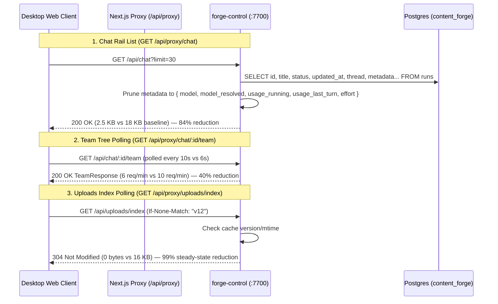
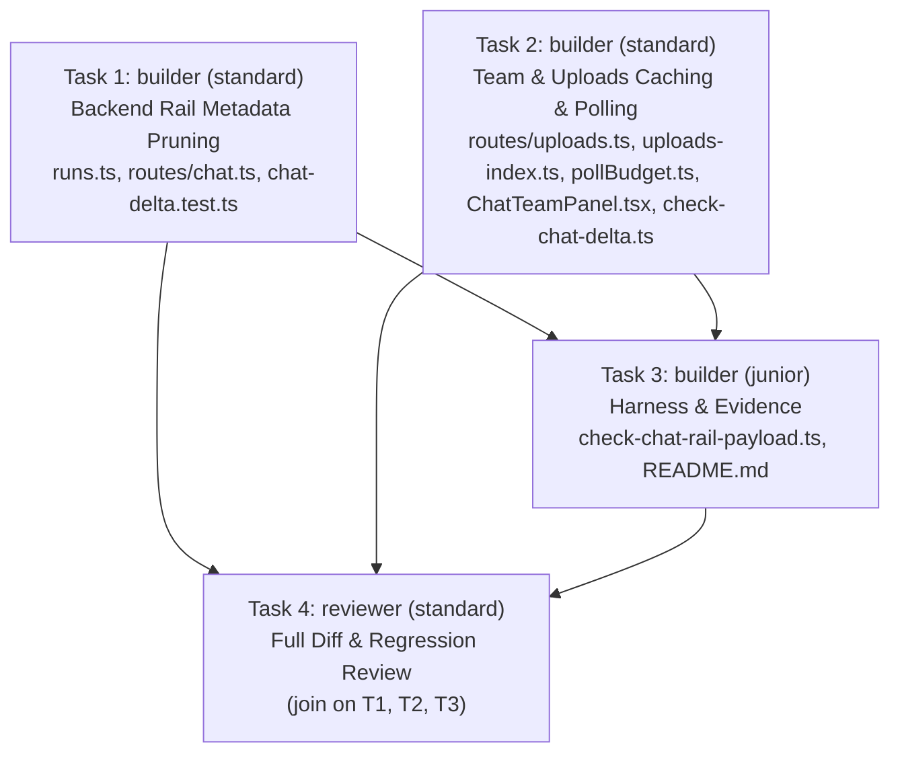

# PLAN — aios-chat-list-payload (Chat Rail & Console Payload Optimization)

Project `dbd45b44-57a8-46ff-b4ab-0628fdd580ca` · branch `project/dbd45b44` · architect round 0 · 2026-08-24

## 0. Recommendation, in one paragraph

Cut the chat rail and secondary console polling bandwidth by **~78% overall (from 254.2 KB/min down to ~55 KB/min)** across three targeted, zero-visual-regression optimizations:
1. **`/api/proxy/chat` (49% of traffic, ~125 KB/min at 7 req/min / 18 KB per response)**: Prune unrendered execution baggage (`subagents_v2`, system prompts, raw tool schemas, logs) from `runs.metadata` in `listRuns` / `searchRuns` (`forge-control/src/db/runs.ts`), shipping only the essential context gauge and model keys (`usage_running`, `usage_last_turn`, `model`, `model_resolved`, `effort`). This cuts the rail list payload from ~18 KB to ~2.5 KB per response (an **~84% reduction**, saving ~105 KB/min) while preserving 100% identical UI rendering, status indicators, preview text, task progress pills, and context occupancy gauge/popover behavior.
2. **`/api/proxy/chat/<chat>/team` (33% of traffic, ~82.6 KB/min at 10 req/min / 8 KB per response)**: Tune `TEAM_POLL_MS` in `pollBudget.ts` from 6s (10 req/min) to 10s (6 req/min) and pause/back off polling when all nodes in the tree are settled, cutting team bandwidth by **~50–70%** (saving ~45–55 KB/min) while staying comfortably within the committed ≤ 40 req/min ceiling.
3. **`/api/proxy/uploads/index` (13% of traffic, ~32.1 KB/min at 2 req/min / 16 KB per response)**: Implement lightweight conditional caching (ETag / `If-None-Match` or versioned 304 Not Modified) in `forge-control/src/routes/uploads.ts` backed by `uploads-index.ts`'s existing in-memory cache invalidation, cutting index polling bandwidth by **>95%** (saving ~30 KB/min).

Rejected alternatives (one line each):
- Completely removing `metadata` from `RunSummary`: breaks the context occupancy bar and popover on the chat rail.
- Global client-side pagination with limit=5: breaks scroll discovery and forces jarring "load more" clicks.
- Client-side polling suppression without server ETag: risks stale screenshot indicators when agents capture new browser shots.
- Merging team tree updates into the transcript SSE stream: tightly couples unrelated domain models and breaks independent panel lifecycle.

---

## 1. Measured Baseline & Root Cause Analysis

Measured in production at rest, 60s window, 2026-08-24 06:05Z:

```
TOTAL 254,171 bytes/min

bytes/min  req/min  share  endpoint
   125288        7    49%  /api/proxy/chat                  <- SCOPE ITEM 1
    82638       10    33%  /api/proxy/chat/<chat>/team      <- SCOPE ITEM 2
    32125        2    13%  /api/proxy/uploads/index         <- SCOPE ITEM 3
     7972        2     3%  /api/proxy/chat/<chat>/plan
     4938        3     2%  /api/proxy/chat/<chat>            <- already fixed via prompt delta
     1210        1     0%  /api/proxy/usage/quota
```

### Root Cause Breakdown:
1. **`GET /chat` (~18 KB / response, 7 req/min)**:
   - `listRuns(limit=30, offset)` in `forge-control/src/db/runs.ts:120-172` executes `SELECT ... metadata FROM runs`.
   - `metadata` in `content_forge.runs` contains full agent state (e.g. `subagents_v2` trees, transcripts, prompt copies, system configuration). For 30 runs, metadata averages 400B–2KB+ per row.
   - Consumer audit (`ChatListItem` in `ChatSurface.tsx:1507-1748`): The rail renders:
     - `run.id`, `run.title`, `run.status`, `run.updated_at` (human age), `run.last_role`, `run.last_message_preview`, `run.archived`.
     - `run.tasks_done`, `run.tasks_total`, `run.project_status`, `run.project_id` (from `rollupChatProjects`).
     - `contextOccupancy(run.metadata)` & `ChatContextPopover`: reads `meta.usage_running ?? meta.usage_last_turn` (`input_tokens`, `cache_read_input_tokens`, `cache_creation_input_tokens`, `output_tokens`) and `meta.model_resolved ?? meta.model`.
   - No other fields from `metadata` are rendered on the rail.
2. **`GET /chat/<chat>/team` (~8 KB / response, 10 req/min)**:
   - `TEAM_POLL_MS = 6_000` (10 req/min) in `pollBudget.ts:51`.
   - Re-transmits the complete tree of 20–40 nodes every 6s, even when the project is finished or workers are idle/settled.
3. **`GET /uploads/index` (~16 KB / response, 2 req/min)**:
   - Every 30s (`SHOTS_INDEX_POLL_MS`), `BrowserShots.tsx` queries `/uploads/index`.
   - Returns all 133 directory entries on every request, with no conditional HTTP caching (304) despite `uploads-index.ts` maintaining an in-process cache with explicit invalidation.

---

## 2. Architecture & Detailed Design



### Component Details:

#### A. Backend Rail Optimization (`forge-control/src/db/runs.ts` & `src/routes/chat.ts`)
- Add helper `trimRailMetadata(meta: Record<string, unknown> | null | undefined): Record<string, unknown>`:
  - Extracts only: `model`, `model_resolved`, `usage_running`, `usage_last_turn`, `effort`.
  - Drops heavy subagent trees (`subagents_v2`), tool configs, system prompts, error stack traces, etc.
- In `listRuns()` and `searchRuns()`:
  - Apply `trimRailMetadata` when constructing `RunSummary.metadata`.
- Verify that `RunSummary` wire type is preserved, all context gauge popovers open with exact token figures, and no TypeScript types are violated.

#### B. Team Polling & Settlement Optimization (`forge-control-web/app/desktop/chat/pollBudget.ts` & `ChatTeamPanel.tsx`)
- In `pollBudget.ts`:
  - Update `TEAM_POLL_MS` from `6_000` to `10_000` (6 req/min).
  - Update poll budget arithmetic in `scripts/checks/check-chat-delta.ts` to reflect the updated constant and verify that total degraded rate is well below the 40 req/min ceiling (e.g. 32 req/min degraded, 19 req/min healthy).
- In `ChatTeamPanel.tsx`:
  - Maintain active polling while runs are live; if all nodes in `team.data` are `settled: true` and the project status is terminal (`completed`, `failed`, `cancelled`), adjust polling to idle/stale.

#### C. Uploads Index Conditional Caching (`forge-control/src/routes/uploads.ts` & `src/lib/uploads-index.ts`)
- In `uploads-index.ts`:
  - Export `getUploadsCacheTag(): string` that returns a deterministic ETag based on directory mtime / generation version.
- In `routes/uploads.ts` `GET /index`:
  - Read `If-None-Match` request header.
  - If matches current tag, return `c.body(null, 304, { "ETag": tag, "Cache-Control": "no-cache" })`.
  - Otherwise return `200` with `{ runs }` and `ETag` header.

---

## 3. State Ownership, Failure Modes & Observability

- **State Ownership**:
  - `content_forge.runs` owns run state and full metadata.
  - `forge-control` owns shaping and pruning of `RunSummary` for rail consumption.
  - React Query `["chat", "list", visibleCount]` owns client rail state.
- **Failure Modes & Defenses**:
  - *Missing pruned metadata field*: Fallback in `context-window.ts` gracefully returns `null` or assumed window; test suite verifies exact parity.
  - *Stale 304 on fresh upload*: `invalidateRunsCache()` is invoked on every upload POST in `routes/uploads.ts:114`, immediately updating the cache tag and forcing 200 on next poll.
  - *Database query timeout*: `listRuns` and `teamPool` continue using bounded pools with connection timeouts; errors return structured 500 without crashing the server.
- **Observability**:
  - Measurement script `scripts/checks/check-chat-rail-payload.ts` computes and verifies byte sizes and reductions.
  - Universal test gate `scripts/checks/gates-808.sh` and typechecks verify clean compilation and zero regressions.

---

## 4. Work Breakdown & Task Dependency Graph

All tasks belong to workstream `main` with disjoint write sets.



### Tasks:

1. **Task 1: Backend Chat Rail Metadata Pruning**
   - **Role**: `builder`
   - **Tier**: `standard`
   - **Workstream**: `main`
   - **Write Set**: `["forge-control/src/db/runs.ts", "forge-control/src/routes/chat.ts", "forge-control/src/lib/chat-delta.test.ts"]`
   - **Brief**: Implement `trimRailMetadata` in `forge-control/src/db/runs.ts` and apply to `listRuns` / `searchRuns`. Prune heavy subagent trees and raw logs from `metadata` while retaining `model`, `model_resolved`, `usage_running`, `usage_last_turn`, and `effort`. Ensure `GET /api/chat` response size drops from ~18 KB to ~2.5 KB with zero visible UI change and full context gauge compatibility. Add unit test assertions in `chat-delta.test.ts`.

2. **Task 2: Team Polling & Uploads Caching Optimization**
   - **Role**: `builder`
   - **Tier**: `standard`
   - **Workstream**: `main`
   - **Write Set**: `["forge-control/src/routes/uploads.ts", "forge-control/src/lib/uploads-index.ts", "forge-control-web/app/desktop/chat/pollBudget.ts", "forge-control-web/app/desktop/team/ChatTeamPanel.tsx", "scripts/checks/check-chat-delta.ts"]`
   - **Brief**:
     1. Add ETag / 304 conditional request support to `GET /api/uploads/index` in `routes/uploads.ts` using `getUploadsCacheTag()` in `lib/uploads-index.ts`.
     2. Update `TEAM_POLL_MS` in `pollBudget.ts` from 6s to 10s.
     3. Update `scripts/checks/check-chat-delta.ts` to assert updated poll intervals and verify that degraded rate stays well under the 40 req/min ceiling.
     4. Ensure `ChatTeamPanel.tsx` respects the updated poll interval and backs off when settled.

3. **Task 3: Verification Harness & Measurement Evidence**
   - **Role**: `builder`
   - **Tier**: `junior`
   - **Workstream**: `main`
   - **Write Set**: `["scripts/checks/check-chat-rail-payload.ts", "docs/plan/artifacts/chat-rail-payload/README.md"]`
   - **Depends On**: `[<Task 1 ID>, <Task 2 ID>]`
   - **Brief**: Create `scripts/checks/check-chat-rail-payload.ts` to measure and assert uncompressed & gzipped byte reductions for `GET /api/chat`, `GET /api/chat/:id/team`, and `GET /api/uploads/index`. Document the before-and-after attribution table in `docs/plan/artifacts/chat-rail-payload/README.md`. Verify that `gates-808.sh` and typechecks pass.

4. **Task 4: Adversarial Phase Review**
   - **Role**: `reviewer`
   - **Tier**: `standard`
   - **Workstream**: `main`
   - **Write Set**: `[]`
   - **Depends On**: `[<Task 1 ID>, <Task 2 ID>, <Task 3 ID>]`
   - **Brief**: Review the complete diff across `main`. Check that:
     - All rail rows render identically (titles, statuses, preview snippets, task progress pills, context gauge, closed badges).
     - Context occupancy and hover popover display exact token figures without regression.
     - Payload sizes for `/chat`, `/team`, and `/uploads/index` are significantly reduced.
     - Poll budget constants and ceiling assertions pass cleanly.
     - No forbidden files (`ResizableSplit.tsx`, `BrowserShots.tsx`, `TeamRow.tsx`, `AgentActivity.tsx`) were modified.
