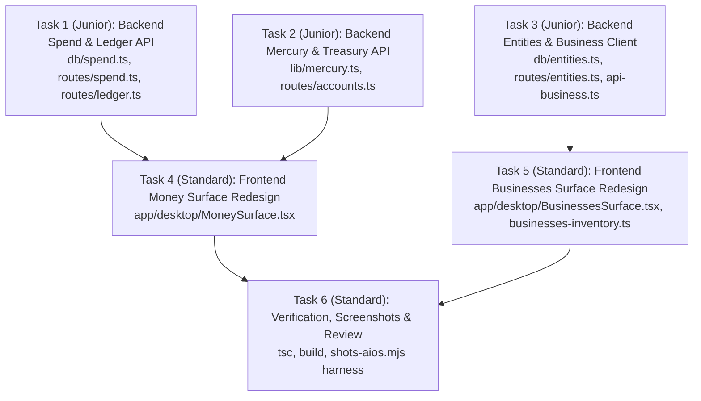

# Architecture Plan: Money and Businesses Surfaces (`aios-money-and-businesses`)

## Executive Recommendations

1. **Spend Number & Accounting Truth:**
   - **Recommendation:** Separate metered out-of-pocket invoice spend from flat-rate subscription shadow compute across all backend queries and UI layers. Fix `db/spend.ts` so `spendSummary()` and `todaySpendRollup()` never conflate Claude flat subscription shadow rate with metered invoice spend against the €50 cap, while including real compute activity in the daily time-series chart. Connect the `ai_os.ledger_entries` cash ledger to the Money surface to display real business cashflow (revenue, contractor costs, infrastructure).
   - **Reasoning:** Konrad is on flat-rate subscriptions for Claude Pro/Team/Max and Google AI Pro, not per-token metered billing. Reporting a notional shadow price as cash spend trips false budget alarms and confuses the operator, while filtering it out of daily charts results in an empty black box.
   - **Rejected Alternatives:**
     - *Dropping shadow pricing entirely:* Rejected; tracking token burn velocity and model usage is critical for infrastructure health.
     - *Inventing per-run cost allocations:* Rejected; `usage_hourly` is box-wide and fabricating per-run figures would violate the accuracy policy.

2. **Bank Connectivity & Treasury Strip:**
   - **Recommendation:** Implement a direct 1st-party read-only REST connector for Mercury Bank (`https://api.mercury.com/api/v1/accounts`) using a token stored in `ai_os.secrets` (`MERCURY_API_TOKEN`). For European accounts (E&G Private Bank, Volksbank), provide GoCardless Bank Account Data (formerly Nordigen) open banking schema + a manual balance override / CSV import capability.
   - **Reasoning:** Mercury provides an official, zero-cost, permanent read-only API token that requires no aggregator. German private banks like E&G lack self-serve developer APIs and require PSD2 open-banking aggregation or manual balance input.
   - **Rejected Alternatives:**
     - *Screen-scraping Volksbank/E&G via browser bots:* Rejected; fragile, violates banking TOS, and Konrad explicitly confirmed Volksbank is not needed.
     - *Plaid for EU banks:* Rejected; expensive minimum commitments compared to GoCardless's free tier.

3. **Money Surface Overhaul (Shrunk & Interactive):**
   - **Recommendation:** Replace defensive multi-line disclaimer text with a compact, high-density two-tiered cockpit:
     - **Tier 1 (Top ~40%):** Treasury & Bank Balances (Mercury Operating/Treasury/Tax Reserve + E&G in native currencies and EUR equivalent) + 30D Cashflow by business arm from `/api/ledger/summary`.
     - **Tier 2 (Bottom ~60%):** Shrunk AI Compute Cockpit with interactive daily spend chart (timeframe: 7D/14D/30D/90D, mode toggle: All Compute / Metered Only / Shadow Only, breakdown by Provider/Kind) and compact quota limit pill.
   - **Reasoning:** Shrinks visual noise by >60%, delivers the requested daily trend visualization, and provides immediate visibility into actual bank balances.
   - **Rejected Alternatives:**
     - *Full double-entry ERP accounting UI:* Rejected; over-engineered for a solo operator needing cashflow awareness.

4. **Businesses Surface Overhaul (Executive Portfolio Hub):**
   - **Recommendation:** Completely eliminate the 1,485-line spec litigator, markdown section citations (§10 Q3), and 22-row server port accordion. Replace with 4 focused **Venture Cards** grounded in live data:
     1. **The Jersey / UK Directory:** 1,053 prospects live from `ai_os.entities`, £49/mo pricing, Next Action: launch 100-call batch, Links to Twenty CRM, Repo, etc.
     2. **TheSkyLab / YouTube Studio:** 3 channels, live job pipeline metrics from `/api/pipeline`, Next Action: review stalled QC jobs, Links to Hub Web, ReelForge, Pipeline.
     3. **Axtrelis (Business Plan Hub):** Visa SaaS ($197/$497/$2,497 tiers), 5 seed plans, Pre-Launch status, Next Action: Cloudflare DNS for `app.axtrelis.com`, Links to Review app, Funnel v9, Repo.
     4. **Schreiner Content Systems / Consulting:** Agency & consulting services, ShiftSync, Status: Paused/Dormant.
     Plus a **Cross-Portfolio Bottlenecks & Action Center** at the bottom.
   - **Reasoning:** Gives the page a real job answering: what is each business, is it alive, what did it earn/cost, what is the next action, and where do I open its tools.
   - **Rejected Alternatives:**
     - *Keeping the funnel spine with spec quotes:* Rejected; verbatim rejected by Konrad as unreadable.
     - *Treating AI OS infrastructure as a commercial venture:* Rejected; AI OS is the operating machine, not a revenue product.

---

## 1. Spend Number Deep Dive: Root Cause & Evidence

### The Discrepancy
- `/api/today` reported: `spend: €102.47 of €50 cap` (now €132.98).
- `/api/spend/summary` reported: `today.total_eur: €0.00`, `today.claude_eur: €132.98`.
- Daily Spend Chart rendered: Blank black box showing only `08-22 | peak €0.01 | 08-22`.

### Evidence & Root Causes
1. **Claude Code Shadow Price Ingest:**
   - In `forge-control/src/executor.ts:1150-1158`, after each Claude execution turn, the runner calls:
     ```typescript
     await recordSpend([{
       provider: "claude-code",
       kind: "llm_output",
       amount_eur: result.costUsd * USD_EUR,
       units: result.numTurns,
       meta: { run_id: run.id, usd: result.costUsd },
     }]);
     ```
   - `result.costUsd` is calculated using standard token rates ($3/M input, $15/M output for Sonnet 3.7). However, Konrad pays a flat monthly subscription. No marginal euros leave his account.
2. **Google Gemini Ingest:**
   - In `forge-control/src/lib/gemini-runner.ts:279`, Gemini calls log `amount_eur: 0` because of the Google AI Pro subscription, storing raw token counts in `units`.
3. **The `/api/today` Query Bug:**
   - In `forge-control/src/db/spend.ts:216-223` (`todaySpendRollup`), the SQL query sums `amount_eur` across **all** providers without filtering out `claude-code`.
   - As a result, `routes/today.ts` took the €132.98 shadow rate, treated it as out-of-pocket invoice cost against `SPEND_CAP_EUR = 50`, and falsely reported an over-budget status.
4. **The Daily Spend Chart Bug:**
   - In `forge-control/src/db/spend.ts:173`, the `daily` query hardcoded `WHERE provider <> 'claude-code'`.
   - Because 99.9% of LLM execution runs via `claude-code` and Gemini rows have `amount_eur = 0`, the query returned zero euros for every single day, completely flatlining the chart.

### The Fix
- `db/spend.ts` will explicitly compute:
  - `metered_eur`: Sum where `provider NOT IN ('claude-code', 'gemini-subscription')` (real invoices: ElevenLabs, OpenAI API, RunPod, etc.).
  - `shadow_eur`: Sum of flat-rate compute value.
  - `total_compute_eur`: `metered_eur + shadow_eur`.
- Daily series returns `{ day, metered_eur, shadow_eur, total_eur, calls }` so the UI can render either total compute burn or metered spend with a single toggle.
- `/api/today` will compare `metered_eur` against the €50 out-of-pocket spend cap, with shadow compute displayed as a secondary metric.

---

## 2. Bank Connectivity Research Note

| Institution | Type / Jurisdiction | API Method | Protocol / Auth | Cost | Feasibility & Recommendation |
|---|---|---|---|---|---|
| **Mercury (3 accounts)** | Business Checking & Treasury (US) | Direct 1st-Party REST API (`api.mercury.com/api/v1/accounts`) | Bearer Token (`MERCURY_API_TOKEN`) generated from Mercury Dashboard | **$0 / Free** (included with account) | **Immediate / High Feasibility:** Implement native `/api/accounts/mercury` route. Read token from secret store. Fetches live balances in seconds with 100% reliability. |
| **E&G Private Bank (Bankhaus Ellwanger & Geiger)** | Private Bank (Germany / EU) | PSD2 Open Banking Aggregator (GoCardless Bank Account Data) | OAuth Requisition Redirect / 90-day consent | Free tier (up to 50 requisitions) / ~€0.05/mo | **Medium Feasibility:** Implement GoCardless connector shell + immediate manual balance override / CSV import in UI for private bank accounts. |
| **Volksbank** | Cooperative Bank (Germany / EU) | PSD2 Open Banking (GoCardless) / FinTS | GoCardless / FinTS (requires TAN) | Free tier on GoCardless | **Optional / Excluded:** Konrad explicitly confirmed Volksbank is not needed. Exclude from active scope. |

### Secret Management Rule
Never ask Konrad to paste bank tokens into chat. The UI will render secure secret triggers (`POST /api/secrets` with `name: "MERCURY_API_TOKEN"`), and the backend reads encrypted credentials from `lib/secret-store.ts`.

---

## 3. Surface Redesign Specifications

### 3.1 Money Surface (`MoneySurface.tsx`)
1. **Header & Timeframe Controls:**
   - Title: `Money · Financial Cockpit`
   - Period Selectors: `[7D]` `[14D]` `[30D]` `[90D]` `[YTD]`
   - Refresh / Sync button.
2. **Treasury & Bank Balances Strip (Top):**
   - Live account cards:
     - `Mercury Operating ($ USD)`: Live balance + sync status dot.
     - `Mercury Treasury ($ USD)`: Live balance + sync status dot.
     - `Mercury Tax Reserve ($ USD)`: Live balance + sync status dot.
     - `E&G Private Bank (€ EUR)`: Live/manual balance.
   - Aggregate banner: `Total Liquid Treasury: €X,XXX (EUR equivalent at current FX)`.
3. **Cashflow & Ledger Summary (Middle):**
   - 3 high-density metric tiles: `Revenue In (MTD)`, `Expenses Out (MTD)`, `Net Cashflow`.
   - Arm distribution bar: `Axtrelis` | `YouTube` | `Infra` | `Personal`.
4. **AI Compute & Telemetry Cockpit (Bottom):**
   - Controls: View Mode `[All Compute (Default) ▾ | Metered Only | Shadow Only]`, Grouping `[By Provider ▾ | By Kind]`.
   - Daily Spend Chart: Render interactive bar chart across selected window. Hover reveals date, EUR, and call counts.
   - Where It Goes: Shrunk progress meter breakdown.
   - Quota Alert Pill: Compact badge `[1 Quota Hit in 14d]` expanding stack trace on click.

### 3.2 Businesses Surface (`BusinessesSurface.tsx`)
1. **Portfolio Overview Strip:**
   - Active Commercial Ventures: 3 Commercial + 1 Consulting.
   - MTD Revenue / Spend overview from ledger.
2. **4 Venture Cards:**
   - **The Jersey / UK Directory (`directory`):**
     - Tagline: B2B Local Marketplace & Services Introducer (£49/mo tier).
     - Live Metrics: 1,053 Sourced Prospects (live from `ai_os.entities`), 0 Contacted, £0 MRR.
     - Bottleneck / Next Action: "1,053 enriched company entities ready in DB. First 100 cold outreach calls not yet initiated."
     - Launchpad Links: `[Open Site ↗]`, `[Twenty CRM ↗]`, `[Repo ↗]`, `[Projects ↗]`.
   - **TheSkyLab / YouTube Studio (`creator`):**
     - Tagline: Faceless Video Publishing & Content Factory (TheSkyLab, KarmaBiker, AI Senior).
     - Live Metrics: 3 Channels, 5 Jobs in Flight, 5 Stalled in QC, 0 Published this month.
     - Bottleneck / Next Action: "5 of 5 jobs stalled >48h in QC. Human review required in Hub Web."
     - Launchpad Links: `[Hub Web ↗]`, `[ReelForge ↗]`, `[Pipeline ↗]`, `[Repo ↗]`.
   - **Axtrelis / Business Plan Hub (`axtrelis`):**
     - Tagline: Investor Visa Business Plan SaaS ($197 / $497 / $2,497).
     - Live Metrics: 5 Seed Plans Generated, 0 Live Customers, Status: `PRE-LAUNCH`.
     - Bottleneck / Next Action: "Cloudflare DNS for app.axtrelis.com returns 404 — route to VPS2 container."
     - Launchpad Links: `[Review App ↗]`, `[Funnel v9 ↗]`, `[Repo ↗]`.
   - **Schreiner Content Systems (`personal`):**
     - Tagline: Personal Brand, Consulting & Custom MVPs (ShiftSync).
     - Metrics: Portfolio site 200 OK, ShiftSync 502, Status: `PAUSED`.
     - Bottleneck / Next Action: "Paused — all focus on YouTube and Directory."
     - Launchpad Links: `[Portfolio Site ↗]`, `[Docs ↗]`.
3. **Cross-Portfolio Bottlenecks & Action Center:**
   - Highlight top blockers across the portfolio requiring operator action.

---

## 4. File Ownership & Boundary Compliance

We touch strictly the files owned by this project:
- `forge-control-web/app/desktop/MoneySurface.tsx`
- `forge-control-web/app/desktop/BusinessesSurface.tsx`
- `forge-control-web/app/desktop/businesses-inventory.ts`
- `forge-control-web/app/api-business.ts`
- `forge-control/src/routes/spend.ts`
- `forge-control/src/routes/ledger.ts`
- `forge-control/src/routes/entities.ts`
- `forge-control/src/routes/accounts.ts` / `forge-control/src/lib/mercury.ts`
- `forge-control/src/db/spend.ts`
- `forge-control/src/db/entities.ts`

We do NOT touch:
- `forge-control-web/app/desktop/nav-items.ts`
- `forge-control-web/app/desktop/DesktopApp.tsx` (beyond existing imports)
- Any files owned by parallel lanes.

---

## 5. Execution Graph & Tasks



### Task Specifications
1. **Task 1: Backend Spend & Ledger API Overhaul**
   - Role: `builder` | Tier: `junior` | Workstream: `main` | Depends on: `[]`
   - Write set: `["forge-control/src/db/spend.ts", "forge-control/src/routes/spend.ts", "forge-control/src/routes/ledger.ts"]`
   - Scope: Fix `spendSummary()` timeframe filtering and daily compute series aggregation. Separate metered vs shadow compute. Add `GET /api/ledger/entries`.
2. **Task 2: Backend Mercury & Bank Accounts Integration**
   - Role: `builder` | Tier: `junior` | Workstream: `main` | Depends on: `[]`
   - Write set: `["forge-control/src/lib/mercury.ts", "forge-control/src/routes/accounts.ts"]`
   - Scope: Implement Mercury REST client reading `MERCURY_API_TOKEN` secret. Return 3 Mercury balances ($ USD) and EUR equivalent. Add GoCardless/manual account shells. Expose `/api/accounts/bank`.
3. **Task 3: Backend Entities Endpoint & Typed Business Client**
   - Role: `builder` | Tier: `junior` | Workstream: `main` | Depends on: `[]`
   - Write set: `["forge-control/src/db/entities.ts", "forge-control/src/routes/entities.ts", "forge-control-web/app/api-business.ts"]`
   - Scope: Implement `GET /api/entities` and `GET /api/entities/summary` in forge-control. Add typed API methods in `api-business.ts` for entities, ledger, spend, and treasury.
4. **Task 4: Frontend Money Surface Redesign**
   - Role: `builder` | Tier: `standard` | Workstream: `main` | Depends on: `[Task 1, Task 2]`
   - Write set: `["forge-control-web/app/desktop/MoneySurface.tsx"]`
   - Scope: Rebuild `MoneySurface.tsx` into a high-density two-tier financial cockpit: Treasury Strip (Mercury 3x + E&G) + Cashflow Summary + AI Compute Cockpit with interactive daily chart and filters.
5. **Task 5: Frontend Businesses Surface Redesign**
   - Role: `builder` | Tier: `standard` | Workstream: `main` | Depends on: `[Task 3]`
   - Write set: `["forge-control-web/app/desktop/BusinessesSurface.tsx", "forge-control-web/app/desktop/businesses-inventory.ts"]`
   - Scope: Rebuild `BusinessesSurface.tsx` with 4 executive Venture Cards (Directory with 1,053 live prospects, YouTube with pipeline metrics, Axtrelis with $197-$2497 tiers, Schreiner Systems), Cross-Portfolio Bottlenecks, and clean tool links. Clean up `businesses-inventory.ts`.
6. **Task 6: Verification, Visual Screenshots & Final Review**
   - Role: `reviewer` | Tier: `standard` | Workstream: `main` | Depends on: `[Task 4, Task 5]`
   - Write set: `[]`
   - Scope: Run `tsc --noEmit` and `npm run build` on both `forge-control-web` and `forge-control`. Execute screenshot harness `shots-aios.mjs` for `money` and `businesses`. Inspect screenshots to verify layout, numbers, and zero-dummy policy.
