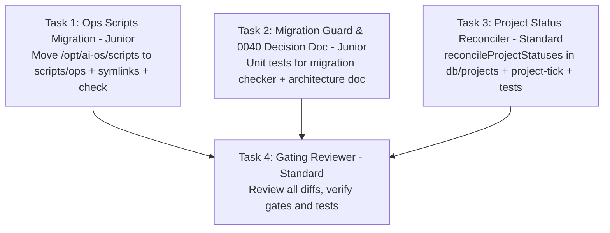

# PLAN — aios-ops-hygiene (Operational Hygiene Fixes)

Project `a19c98b5-9402-4e09-a6a3-eff44e616dd3` · branch `project/a19c98b5` · architect round 0 · 2026-08-24

## 0. Recommendation, in one paragraph

Address three operational defects across Konrad's Personal AI OS stack:
1. **Ops Scripts Version Control (Defect 1)**: Move all operational host scripts from `/opt/ai-os/scripts/` into this repository under `scripts/ops/` (including `safe-restart.sh` carrying the 2026-08-23 `$FORGE_RUN_UUID` self-exclusion logic, `claude-code-autoupdate.sh`, `reap-orphan-agents.sh`, `pg-backup.sh`, `fleet-watchdog.sh`, `stalled-projects.sh`, `check-corpus-backup.sh`, `check-vps2-backup.sh`, `prune-corpus-offbox.sh`, `agy-dropout-stopgap.sh`, `canvas`, `deploy-goal-mode.sh`, `deploy-retier.sh`, `rebuild-web.sh`, and the goal json templates). Preserve `/opt/ai-os/scripts/` backwards compatibility via `scripts/ops/install-symlinks.sh` so crons and existing deploy runbooks continue functioning without breakage. Add `scripts/checks/check-ops-scripts.sh` verifying script presence, executable permissions, and syntax.
2. **Duplicate Migration 0040 & Collision Guard (Defect 2)**: Retain the existing `scripts/checks/check-migration-numbers.ts` gate with its pinned exact-pair allowlist for the historical applied pair `["0040_task_graph.sql", "0040_usage_hourly.sql"]`. Explicitly document the architectural decision **NOT** to renumber applied production migrations (as both tables are already applied in production, independent, and renumbering would break historical tracking and test harnesses for no operational gain). Add unit tests in `forge-control/src/lib/migration-numbers.test.ts` ensuring any new duplicates or unallowlisted collisions fail loudly.
3. **Stale Project Status Reconciler (Defect 3)**: Implement `reconcileProjectStatuses()` in `forge-control/src/db/projects.ts` wired into `projectTick()` in `forge-control/src/lib/project-tick.ts` and exposed via `GET /api/projects/reconcile`. The reconciler auto-closes **ONLY** the unambiguous case: projects with `status = 'blocked'` having zero non-done and non-cancelled tasks (total tasks > 0), transitioning them to `status = 'done'` with a completion notification. Projects in `status = 'paused'` or `status = 'active'` with all tasks completed are detected as disagreements and reported/surfaced via warnings and API responses, but **NEVER mutated** (preserving intentional pauses and R70 workstream integration gates).

Rejected alternatives (one line each):
- Symlinking `/opt/ai-os/scripts` to worktrees directly: rejected because worktrees are ephemeral per-project directories; symlinks must target the canonical `/opt/forge-ai-os/scripts/ops/`.
- Renumbering `0040_task_graph.sql` to `0046_task_graph.sql`: rejected because 0040 is already applied to production database; renumbering would desync migration history from database catalogs and break existing regression harnesses without fixing an active defect.
- Blanket-updating `paused` or `active` projects with all tasks done: rejected because paused/active states may be deliberate operator holds or unintegrated R70 workstreams requiring manual intervention.

---

## 1. What Exists (Read, Not Remembered)

- `/opt/ai-os/scripts/`: Untracked directory holding 18 operational scripts and 4 JSON goal configs.
  - `safe-restart.sh`: Guard script preventing restarts while runs are active; contains single-instance flock (`-E 99`) and `$FORGE_RUN_UUID` self-exclusion (added 2026-08-23).
  - Crontab entries calling `/opt/ai-os/scripts/claude-code-autoupdate.sh`, `reap-orphan-agents.sh`, and `pg-backup.sh`.
- `db/migrations/`: Contains 26 migrations from `0021_ai_os_tables.sql` to `0045_journal_entries.sql`. Both `0040_task_graph.sql` and `0040_usage_hourly.sql` are applied in production.
- `scripts/checks/check-migration-numbers.ts`: Gate asserting 4-digit zero-padded unique migration numbers, with strict allowlist `KNOWN_COLLISIONS` for `0040`. Wired into `scripts/checks/gates-808.sh` line 174.
- `forge-control/src/db/projects.ts`:
  - `closeFinishedProjects()`: Updates `p.status = 'done'` only for `WHERE p.status = 'active'` when all tasks are done and R70 unintegrated workstream check passes. Skips `blocked` and `paused` projects.
  - `listActiveTasks()` & `listManagerRollup()`: Filter on `status IN ('active', 'blocked')`, causing completed `blocked` and `active` projects to render indefinitely on the Kanban board.
- `forge-control/src/lib/project-tick.ts`: Dispatches `projectTick()` calling `promoteReadyTasks()`, `reconcileSettledTasks()`, and `closeFinishedProjects()`.

---

## 2. Architecture & State Ownership

### State Ownership & Workflow
1. **Ops Scripts**:
   - Canonical repo path: `scripts/ops/` in `ai-os`.
   - Host compatibility path: `/opt/ai-os/scripts/` symlinked to `/opt/forge-ai-os/scripts/ops/` files via `scripts/ops/install-symlinks.sh`.
2. **Migration Numbering & Gate**:
   - Gate: `scripts/checks/check-migration-numbers.ts` enforces uniqueness for all migrations.
   - Pinned debt: `0040` (`0040_task_graph.sql` and `0040_usage_hourly.sql`) is explicitly recorded as known debt.
   - Policy: Never renumber applied production migrations. Any new collision or unnumbered file fails exit 1.
3. **Project Status Reconciler**:
   - State owner: PostgreSQL `projects` and `project_tasks` tables.
   - Dispatcher: `projectTick()` in `forge-control/src/lib/project-tick.ts` executes `reconcileProjectStatuses()` on every scheduler tick.
   - State Machine & Mutation Rules:
     - **Unambiguous Case (Auto-Close)**:
       - Condition: `p.status = 'blocked'` AND `tasks_total > 0` AND `COUNT(*) FILTER (WHERE status NOT IN ('done', 'cancelled')) = 0`.
       - Action: `UPDATE projects SET status = 'done', updated_at = now() WHERE id = ... AND status = 'blocked'`.
       - Notification: `✅ Project "${name}" is done — auto-closed from blocked state (all tasks completed)`.
     - **Ambiguous Cases (Report Only, No Mutation)**:
       - Condition 1: `p.status = 'paused'` AND `tasks_total > 0` AND all tasks in `('done', 'cancelled')`.
         - Action: Log warning `[project-tick] project ${id} ("${name}") is paused but has all ${tasks_done}/${tasks_total} tasks completed (status preserved)`. Include in reconciliation report.
       - Condition 2: `p.status = 'active'` AND `tasks_total > 0` AND all tasks in `('done', 'cancelled')` but unclosed (e.g. held by R70 unintegrated workstreams).
         - Action: Log warning stating why it is held open. Include in reconciliation report.
   - API Exposure: `GET /api/projects/reconcile` in `forge-control/src/routes/projects.ts` returns `{ closed: Project[], disagreements: DisagreementReport[] }`.

---

## 3. Failure Modes & Observability

- **What happens on script execution failure**:
  - `check-ops-scripts.sh` fails in CI/preflight if any script is missing, non-executable, or fails `bash -n`.
  - `safe-restart.sh` logs all attempts to `/var/log/forge-safe-restart.log` and exits 2 if quiet threshold is not met within `MAX_WAIT`.
- **What happens on migration collision**:
  - `check-migration-numbers.ts` outputs colliding names and exits 1, failing `gates-808.sh`.
- **What happens on reconciler error**:
  - Handled per-project in try-catch inside `projectTick()`; failures log to stderr without aborting the tick loop.
- **How Konrad sees it broke**:
  - Disagreements surfaced in `GET /api/projects/reconcile`, console logs, Telegram/UI notifications on auto-close, and clean Kanban board state.

---

## 4. Work Breakdown & Task Graph

### Task 1: Migrate ops scripts to scripts/ops and preserve /opt/ai-os/scripts compatibility
- **Role**: `builder` | **Tier**: `junior` | **Workstream**: `main`
- **Depends on**: `[]`
- **Write Set**:
  - `scripts/ops/safe-restart.sh`
  - `scripts/ops/claude-code-autoupdate.sh`
  - `scripts/ops/reap-orphan-agents.sh`
  - `scripts/ops/pg-backup.sh`
  - `scripts/ops/fleet-watchdog.sh`
  - `scripts/ops/stalled-projects.sh`
  - `scripts/ops/check-corpus-backup.sh`
  - `scripts/ops/check-vps2-backup.sh`
  - `scripts/ops/prune-corpus-offbox.sh`
  - `scripts/ops/agy-dropout-stopgap.sh`
  - `scripts/ops/canvas`
  - `scripts/ops/deploy-goal-mode.sh`
  - `scripts/ops/deploy-retier.sh`
  - `scripts/ops/rebuild-web.sh`
  - `scripts/ops/goal-engine-v2.json`
  - `scripts/ops/goal-files-pane.json`
  - `scripts/ops/goal-manager-split.json`
  - `scripts/ops/goal-operator-visibility.json`
  - `scripts/ops/install-symlinks.sh`
  - `scripts/ops/README.md`
  - `scripts/checks/check-ops-scripts.sh`
- **Brief**:
  1. Copy all host operational scripts from `/opt/ai-os/scripts/` into `scripts/ops/` in this repository (`safe-restart.sh` with 2026-08-23 `$FORGE_RUN_UUID` self-exclusion logic, `claude-code-autoupdate.sh`, `reap-orphan-agents.sh`, `pg-backup.sh`, `fleet-watchdog.sh`, `stalled-projects.sh`, `check-corpus-backup.sh`, `check-vps2-backup.sh`, `prune-corpus-offbox.sh`, `agy-dropout-stopgap.sh`, `canvas`, `deploy-goal-mode.sh`, `deploy-retier.sh`, `rebuild-web.sh`, and the goal json templates).
  2. Create `scripts/ops/install-symlinks.sh` that sets up symlinks from `/opt/ai-os/scripts/` to `/opt/forge-ai-os/scripts/ops/` so crons (`claude-code-autoupdate.sh`, `reap-orphan-agents.sh`, `pg-backup.sh`) and operator commands remain intact.
  3. Create `scripts/checks/check-ops-scripts.sh` verifying that all expected ops scripts exist in `scripts/ops/`, are executable, pass `bash -n`, and `safe-restart.sh` contains the self-exclusion and single-instance lock.
  4. Add documentation in `scripts/ops/README.md`.

### Task 2: Verify migration number guard and document 0040 historical pair decision
- **Role**: `builder` | **Tier**: `junior` | **Workstream**: `main`
- **Depends on**: `[]`
- **Write Set**:
  - `scripts/checks/check-migration-numbers.ts`
  - `forge-control/src/lib/migration-numbers.test.ts`
  - `docs/architecture/migration-hygiene.md`
- **Brief**:
  1. Review and verify `scripts/checks/check-migration-numbers.ts`: ensure it checks 4-digit zero-padded numbering, uniqueness, tolerates strictly the exact allowlisted pair `["0040_task_graph.sql", "0040_usage_hourly.sql"]`, and fails on any 3rd file on 0040 or new collision.
  2. Create comprehensive unit tests in `forge-control/src/lib/migration-numbers.test.ts` asserting behavior against test fixtures (clean migrations, duplicate numbers, unnumbered files, invalid widths, allowlisted 0040 pair).
  3. Document the explicit decision NOT to renumber the historical 0040 pair in `docs/architecture/migration-hygiene.md`.

### Task 3: Implement project status reconciler for stale blocked and finished projects
- **Role**: `builder` | **Tier**: `standard` | **Workstream**: `main`
- **Depends on**: `[]`
- **Write Set**:
  - `forge-control/src/db/projects.ts`
  - `forge-control/src/lib/project-tick.ts`
  - `forge-control/src/routes/projects.ts`
  - `forge-control/src/lib/project-status-reconcile.test.ts`
- **Brief**:
  1. In `forge-control/src/db/projects.ts`, implement `reconcileProjectStatuses()`:
     - Query projects with `status IN ('active', 'blocked', 'paused')` and their task summaries.
     - Unambiguous case: when `status = 'blocked'` AND `tasks_total > 0` AND all tasks are in `('done', 'cancelled')`, auto-close project to `status = 'done'`, update `updated_at = now()`, and queue notification.
     - Ambiguous cases: when `status = 'paused'` or `status = 'active'` with all tasks completed, DO NOT mutate; record as disagreement in the returned report and log a warning.
  2. In `forge-control/src/lib/project-tick.ts`, call `reconcileProjectStatuses()` in `projectTick()`.
  3. In `forge-control/src/routes/projects.ts`, add `GET /reconcile` (or query param on `/`) returning reconciliation status and detected disagreements.
  4. Create comprehensive unit tests in `forge-control/src/lib/project-status-reconcile.test.ts` testing:
     - Blocked project with 12/12 done -> auto-closed to done
     - Blocked project with 10 done, 2 cancelled -> auto-closed to done
     - Blocked project with 1 failed task -> remains blocked
     - Paused project with 4/4 done -> remains paused, reported in disagreements
     - Active project with 88/88 done -> remains active, reported in disagreements

### Task 4: Gating Review of Ops Scripts, Migration Guard, and Reconciler
- **Role**: `reviewer` | **Tier**: `standard` | **Workstream**: `main`
- **Depends on**: `[Task 1, Task 2, Task 3]`
- **Write Set**: `[]`
- **Brief**:
  Review all changes across the three defects:
  1. Ops scripts properly moved to `scripts/ops/` with preserved permissions, symlink script, and verification check.
  2. Migration collision guard `check-migration-numbers.ts` is robust, well-tested, and 0040 decision documented.
  3. Project status reconciler auto-closes ONLY unambiguous `blocked` projects with 0 non-done/non-cancelled tasks, leaves `paused` and `active` unmutated while reporting disagreements, and passes all unit tests.
  4. All gates (`gates-808.sh`), unit tests (`pnpm test`), and typechecks (`tsc --noEmit`) pass clean.
