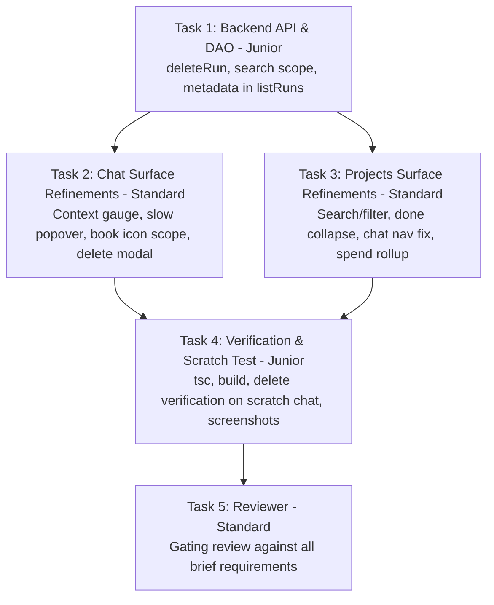

# PLAN — aios-projects-and-chat (Projects List + Chat Refinements)

Project 3a4383fd · branch project/3a4383fd · architect round 0 · 2026-08-23

## 0. Recommendation, in one paragraph

Fix the two core user experience breakdowns across the Projects and Chat surfaces:
1. **Projects Surface**: Demote and collapse the `Done` column into a compact, expandable strip by default so active role work is immediately visible without horizontal scrolling; add a full-featured search bar and status/repo/date filter controls; update the task role mapping to include `researcher`, `tester`, and `steward`; display project token/spend metrics from `/api/projects/managers`; and **fix card-click navigation** by updating `localStorage` (`forge.chat.selected` and `forge.desktop.surface`) and triggering surface transition to `chat`, navigating Konrad directly to the full `CHAT` surface instead of trapping him in an isolated project chat.
2. **Chat Surface**: Add real-time **context window gauges** per manager chat in the rail (using the exact `contextOccupancy` formula: last turn `input_tokens + cache_read_input_tokens` / model window size); add a **slow-fade hover popover** (deliberate 450ms delay + 250ms fade) detailing model, token counts, breakdown, and headroom status; add a **search scope toggle book icon** (`📖`) on the right of the search field switching between `open` chats (default) and `all` historical chats; add a **transparent storage explanation** in the UI ("Stored in PostgreSQL `content_forge.runs` & vector memory `chat://`"); and implement **full chat deletion** (`DELETE /api/chat/:id`) with an explicit destructive confirmation modal that permanently removes the `runs` row, thread history, and vector embeddings in `knowledge_embeddings` (`chat://<id>`).

Rejected alternatives (one line each):
- Embedded project chat sub-view inside Projects: traps the user without chat rail/tools; replacing it with direct navigation to `CHAT` restores full operating power.
- Client-only filtering for chat search: un-indexed and slow over large histories; passing `scope=open|all` to `/api/chat/search` queries Postgres directly.
- Soft-archive masquerading as deletion: leaves vector memory polluted; real deletion must execute `DELETE` queries across `runs` and `knowledge_embeddings`.
- Aggregating cumulative tokens across turns for context gauge: inflates context percentage and falsely triggers panic; using `usage_running` (turn input + cache read) reflects real context occupancy.

---

## 1. What Exists (Read, Not Remembered)

- `forge-control-web/app/desktop/ProjectsSurface.tsx` (974 lines): Renders the left rail with active projects and the Kanban board with 5 hardcoded roles + uncollapsed Done column (88 tasks). Clicking a card currently sets `selTaskId`, rendering an isolated `<TaskDetail>` instead of navigating to `CHAT`.
- `forge-control-web/app/desktop/ChatSurface.tsx` (2711 lines): Renders the 3-pane chat interface. Rail lists manager chats but lacks context indicators, hover popovers, search scope toggle, and chat deletion.
- `forge-control-web/app/desktop/chat/context-window.ts` (250 lines): Pure helper exporting `contextOccupancy()`, `contextBand()`, `humanTokens()`, and model context window mappings.
- `forge-control/src/db/runs.ts` (862 lines): DAO for `runs`. `listRuns` omits `metadata` from summary; `searchRuns` has no `scope` filter; no `deleteRun` method exists.
- `forge-control/src/routes/chat.ts` (1956 lines): Routes for `/api/chat/*`. Has `GET /search`, `POST /:id/archive`, but no `DELETE /:id`.
- `content_forge.knowledge_embeddings`: Stores vector embeddings with `source_path = 'chat://' || run_id`.

---

## 2. Architecture & State Ownership

### State Ownership & Data Flow
- **Chat Context & Window Gauges**:
  - `forge-control/src/db/runs.ts` `listRuns` and `searchRuns` select `metadata` and return it on `RunSummary`.
  - `ChatSurface` rail computes occupancy via `contextOccupancy(run.metadata)`.
  - Pressure bands (`calm`, `noticed`, `warn`, `danger`) map to theme tokens (`tokens.ok`, `tokens.info`, `tokens.warn`, `tokens.bleed`).
- **Chat Search Scope**:
  - Search input component holds `searchScope: "open" | "all"`.
  - Icon button toggles state.
  - Queries `GET /api/chat/search?q=<q>&scope=<scope>`. Backend filters `archived = false` when `scope === "open"`.
- **Chat Deletion**:
  - Destructive modal confirms intent, displaying chat title, run ID, and exact resources to be deleted.
  - Calls `DELETE /api/chat/:id`.
  - Backend transaction/queries:
    1. `DELETE FROM knowledge_embeddings WHERE source_path = 'chat://' || $1 OR source_path LIKE 'chat://' || $1 || '%'`
    2. `DELETE FROM runs WHERE id = $1`
  - Web invalidates `["chat", "list"]`, clears active selection if deleted chat was open, and toasts confirmation.
- **Projects Board & Navigation**:
  - Rail filters by status (`all`, `active`, `done`, `paused`) and repository (`all`, `ai-os`, `content-forge`, `scratch`), and query text.
  - Kanban board demotes `Done` column to collapsed accordion by default (`Done (88) [Show]`).
  - Card click with `task.run_id`:
    - Writes `localStorage.setItem("forge.chat.selected", JSON.stringify(task.run_id))`
    - Writes `localStorage.setItem("forge.desktop.surface", JSON.stringify("chat"))`
    - Invokes `onNavigate("chat")` and dispatches `"forge:nav"` event.
  - Tasks without `run_id` (not yet started): displays task brief modal with retry/start actions.
  - Project stats: queries `GET /api/projects/managers` to display dollar spend, token counts, and progress ratios (`tasks_done / tasks_total`).

---

## 3. Failure Modes & Observability

- **What happens on API / Database failure during deletion**:
  - Hard error (HTTP 500 / 404 / 400).
  - UI displays visible error toast with verbatim error message; does not optimistically remove the chat row.
- **What happens on missing run metadata**:
  - `contextOccupancy` returns `null`. Gauge renders nothing or muted placeholder; never displays a misleading 0%.
- **How does Konrad see it broke**:
  - Status dots, toast notifications, error banners on failed query refetches, and strict TypeScript types across all boundaries.

---

## 4. Work Breakdown & Dependency Graph

### Task 1: Backend DAO & Routes (`forge-control` & Web API)
- **Role**: `builder` | **Tier**: `junior` | **Workstream**: `main`
- **Write Set**:
  - `forge-control/src/db/runs.ts`
  - `forge-control/src/routes/chat.ts`
  - `forge-control-web/app/api.ts`
- **Brief**:
  1. In `forge-control/src/db/runs.ts`: Include `metadata` in `listRuns` and `searchRuns` query results. Update `searchRuns` to accept `opts.scope: "open" | "all"` (filter `WHERE archived = false` when `scope === "open"`). Add `deleteRun(id: string)` that deletes from `knowledge_embeddings` where `source_path = 'chat://' || $1` and deletes from `runs` where `id = $1`.
  2. In `forge-control/src/routes/chat.ts`: Mount `r.delete("/:id")` calling `deleteRun(id)` with UUID validation; update `r.get("/search")` to parse `scope` query param.
  3. In `forge-control-web/app/api.ts`: Update `RunSummary` interface with `metadata?: Record<string, unknown>`; update `searchChats(q, scope)` and add `deleteChat(id)`.

### Task 2: Chat Surface Refinements & Context Popover
- **Role**: `builder` | **Tier**: `standard` | **Workstream**: `main`
- **Depends on**: `[Task 1]`
- **Write Set**:
  - `forge-control-web/app/desktop/ChatSurface.tsx`
  - `forge-control-web/app/desktop/chat/ContextGauge.tsx`
  - `forge-control-web/app/desktop/chat/ChatContextPopover.tsx`
- **Brief**:
  1. Create `ChatContextPopover.tsx` in `app/desktop/chat/` with slow-fade hover popover (450ms delay + 250ms CSS fade) displaying model, context tokens (`usedTokens / windowTokens`), breakdown (input, cache read, output), and headroom status.
  2. In `ChatSurface.tsx` `ChatListItem`: render a compact context gauge next to status with pressure color and the slow popover.
  3. In `ChatSurface.tsx` search container: add the tiny book icon button (`📖`) on the right of the search field to toggle between `open` chats and `all` chats. Update search query with scope and show single-char hint.
  4. In `ChatSurface.tsx`: add 1-line storage info note in rail footer ("Stored in PostgreSQL runs + vector memory `chat://`").
  5. In `ChatSurface.tsx`: add delete button (`🗑`) on chat row hover that opens a strict confirmation modal explaining exact resources to be deleted before dispatching `deleteChat`.

### Task 3: Projects Surface Refinements & Chat Navigation
- **Role**: `builder` | **Tier**: `standard` | **Workstream**: `main`
- **Depends on**: `[Task 1]`
- **Write Set**:
  - `forge-control-web/app/desktop/ProjectsSurface.tsx`
  - `forge-control-web/app/desktop/DesktopApp.tsx`
- **Brief**:
  1. In `ProjectsSurface.tsx`: sort projects by active status first (`active` > `blocked` > `paused` > `done` > `cancelled`, then `updated_at DESC`).
  2. Add search bar and filter controls (status, repo, date) in the projects left rail.
  3. Collapse the `Done` column by default on the Kanban board with an expandable toggle so active work is not pushed offscreen.
  4. Support all task roles (`architect`, `planner`, `scout`, `researcher`, `builder`, `reviewer`, `steward`, `tester`) in the role mapping.
  5. Fetch and render manager stats/spend rollup (`/api/projects/managers`) showing dollar spend and task progress.
  6. **Fix chat navigation**: clicking any task with `task.run_id` writes `forge.chat.selected`, writes `forge.desktop.surface = "chat"`, invokes `onNavigate("chat")`, and opens the conversation in the full `CHAT` surface.
  7. In `DesktopApp.tsx`: pass `onNavigate={(s) => setSurface(s)}` to `<ProjectsSurface />` on line ~459.

### Task 4: Verification, Scratch Testing & Screenshots
- **Role**: `builder` | **Tier**: `junior` | **Workstream**: `main`
- **Depends on**: `[Task 2, Task 3]`
- **Write Set**:
  - `forge-control-web/app/desktop/chat/delete-test.ts`
- **Brief**:
  1. Run `npx tsc --noEmit` and `npm run build` in `forge-control-web` and verify 0 errors.
  2. Create a scratch conversation via `POST /api/chat`, verify it appears in search, delete it via `DELETE /api/chat/:id`, and verify it is completely purged from `runs` and `knowledge_embeddings`.
  3. Run screenshot harness `shots-aios.mjs` for surfaces `tasks` and `chat` and verify visual correctness.

### Task 5: Gating Review
- **Role**: `reviewer` | **Tier**: `standard` | **Workstream**: `main`
- **Depends on**: `[Task 4]`
- **Write Set**: `[]`
- **Brief**:
  Adversarially verify all brief requirements: clean TypeScript compilation, Next.js build, visual appearance of context gauges, slow-fade popover, book icon search scope toggle, storage note, chat delete modal and backend cleanup, project list sorting/search/filter, Done column collapse, and cross-surface chat navigation.

