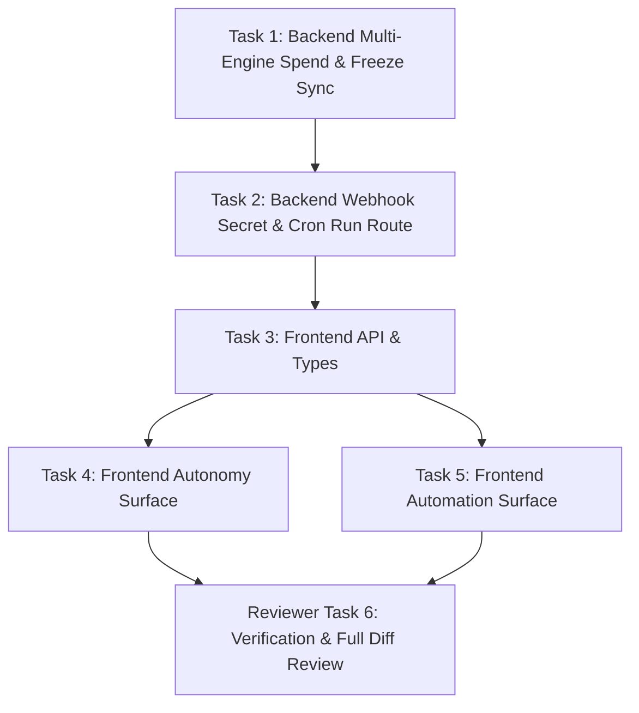

# PLAN: Autonomy & Automation Architecture

## Executive Summary
This project resolves two critical operating bugs and elevates the **Autonomy** and **Automation** surfaces to production readiness:
1. **Model-Aware Spend Estimation:** Differentiates flat-subscription Gemini runs (€0.00 direct token billing, evaluated on 1M token budget) from per-token Claude runs (€0.04/kchar against EUR caps), allowing financial guardrails to be safely re-enabled.
2. **Emergency Pause & Fleet Freeze Synchronization:** Unifies `fleet_state` and `runtime.pause_all` in a single synchronized source of truth across UI toggles, hero buttons, Telegram bot, and the executor.
3. **Autonomy Surface:** Upgrades the rule editor with inline configuration controls, comprehensive incident stream diagnostics with 1-click incident resolution, deep-links to runs, and unified category filtering.
4. **Automation Surface:** Re-anchors the surface around **Scheduled Routines (Cron)** as the primary operating interface, fixes the webhook secret-masking bug on creation, adds on-demand `[Run Now]` execution (`POST /api/cron/:id/run`), humanizes schedules to Berlin Time, and provides a direct cross-link to `Settings → Connections`.

---

## File Ownership & Responsibilities

| File | Owner / Role | Deliverables |
| :--- | :--- | :--- |
| `forge-control/src/executor.ts` | Builder (Task 1) | Pre-flight spend check checks `isGeminiModel`; sets `estSpendEur = 0` for Gemini and checks token limits. |
| `forge-control/src/db/autonomy.ts` | Builder (Task 1) | Synchronize `runtime.pause_all` with `fleet_state`; evaluate model-specific token budgets in `evaluateOne`. |
| `forge-control/src/db/ai_os.ts` | Builder (Task 1) | `setFleetState` updates `guardrail_rules` `runtime.pause_all`. |
| `forge-control/src/routes/autonomy.ts` | Builder (Task 1) | Gating checks and route handling. |
| `forge-control/src/db/webhooks.ts` | Builder (Task 2) | `createWebhook` returns raw `secret` for initial display. |
| `forge-control/src/routes/webhooks.ts` | Builder (Task 2) | Return raw secret in 201 response. |
| `forge-control/src/db/cron.ts` | Builder (Task 2) | Add `fireScheduleById(id)` helper for manual triggers. |
| `forge-control/src/routes/cron.ts` | Builder (Task 2) | Add `POST /:id/run` route. |
| `forge-control-web/app/api.ts` | Builder (Task 3) | Add `resolveTrip`, `triggerScheduleRun`, update webhook/cron types. |
| `forge-control-web/app/desktop/AutonomySurface.tsx` | Builder (Task 4) | Rule editor, incident triage stream with resolve action, category filtering, synchronized freeze hero. |
| `forge-control-web/app/desktop/AutomationSurface.tsx` | Builder (Task 5) | Cron routines as default tab, `[Run Now]` button, webhook create flow with raw secret copy, Berlin time formatting, Settings link banner. |

---

## Task Graph & Execution Order

### Task 1: Backend Multi-Engine Spend Estimation & Fleet Freeze Sync
- **Role:** `builder` | **Tier:** `junior` | **Workstream:** `main` | **Depends on:** `[]`
- **Write Set:** `["forge-control/src/executor.ts", "forge-control/src/db/autonomy.ts", "forge-control/src/db/ai_os.ts", "forge-control/src/routes/autonomy.ts"]`

### Task 2: Backend Automation Routes (Webhook Raw Secret & Cron Run Now)
- **Role:** `builder` | **Tier:** `junior` | **Workstream:** `main` | **Depends on:** `[Task 1]`
- **Write Set:** `["forge-control/src/db/webhooks.ts", "forge-control/src/routes/webhooks.ts", "forge-control/src/db/cron.ts", "forge-control/src/routes/cron.ts"]`

### Task 3: Frontend API & Type Definitions
- **Role:** `builder` | **Tier:** `junior` | **Workstream:** `main` | **Depends on:** `[Task 2]`
- **Write Set:** `["forge-control-web/app/api.ts"]`

### Task 4: Frontend Autonomy Surface Cockpit
- **Role:** `builder` | **Tier:** `junior` | **Workstream:** `main` | **Depends on:** `[Task 3]`
- **Write Set:** `["forge-control-web/app/desktop/AutonomySurface.tsx"]`

### Task 5: Frontend Automation Surface (Scheduled Routines & Webhooks)
- **Role:** `builder` | **Tier:** `junior` | **Workstream:** `main` | **Depends on:** `[Task 3]`
- **Write Set:** `["forge-control-web/app/desktop/AutomationSurface.tsx"]`

### Task 6: End-to-End Verification & Diff Review
- **Role:** `reviewer` | **Tier:** `junior` | **Workstream:** `main` | **Depends on:** `[Task 4, Task 5]`
- **Scope:** Full TypeScript check, build verification, route verification, screenshot captures.
