# ⚡ Personal AI Operating System (AI-OS)

> **The Sovereign, Single-Operator AI Operating System & Cognitive Cockpit.**  
> Unifying multi-agent autonomous dev worktrees, second-brain GraphRAG, financial spend accounting, and video pipeline automation behind a unified control plane.

[](https://www.typescriptlang.org/)
[](https://nextjs.org/)
[](https://hono.dev/)
[](https://www.postgresql.org/)
[](https://modelcontextprotocol.io/)
[](LICENSE)

---

## 🌟 Overview & Architecture

The **Personal AI Operating System** is an enterprise-grade execution platform engineered to run end-to-end technical, business, and creative operations for a single high-leverage operator. 

Rather than relying on stochastic, error-prone LLM routing, AI-OS uses **deterministic TypeScript state machines**, **PostgreSQL atomic queue claims (`FOR UPDATE SKIP LOCKED`)**, **isolated git worktrees**, and **in-database GraphRAG multi-hop retrieval**.

```mermaid
flowchart TB
    subgraph Clients ["1. Client & Ingress Layer"]
        WebUI["Desktop Cockpit & Mobile Web<br/>(Next.js 14 on :7701)"]
        TG["Telegram Bridge Bot<br/>(@vps_cat_bot)"]
        Obsidian["Obsidian Second Brain<br/>(CouchDB LiveSync)"]
        Nginx["Nginx Reverse Proxy<br/>(TLS Termination)"]
    end

    subgraph ControlPlane ["2. Control Plane (forge-control :7700)"]
        Hono["Hono API Gateway<br/>(29 REST Modules)"]
        Guardrails["Guardrail Pre-flight Engine<br/>(evaluateGuardrails)"]
        CronTick["Cron Scheduler Loop<br/>(15s Tick)"]
        TgBridge["Telegram Sync & Push Loop"]
        VaultSync["Vault Sync Tick Loop<br/>(5m Interval)"]
    end

    subgraph ExecutionPlane ["3. Run Engine & Multi-Agent Manager (forge-executor)"]
        QueueClaim["Atomic Claimer<br/>(SKIP LOCKED)"]
        Concurrency["Concurrency Semaphore<br/>(agent.spawn_cap)"]
        Compressor["Thread Compressor<br/>(Sliding Window)"]
        CCRunner["Claude Code Headless Runner<br/>('claude -p' JSONL stream)"]
        ProjectTick["Deterministic Project Tick<br/>(Worktree Isolation)"]
        Watchdog["Stuck Watchdog<br/>(90s Timeout)"]
    end

    subgraph ToolingAndMCP ["4. Tooling & MCP Subsystem"]
        ForgeMCP["forge-control-mcp<br/>(Stdio Server)"]
        ExtMCP["External MCPs<br/>(Context7, Playwright, GitHub, etc.)"]
        SkillsLib["Skills Library<br/>(90+ Curated Skills)"]
    end

    subgraph StorageLayer ["5. Memory & Persistence Layer"]
        subgraph Postgres ["PostgreSQL 16"]
            RunsTable[("runs, threads & spend_log")]
            ProjectsTable[("projects, tasks & worktrees")]
            RulesTable[("guardrail_rules & trips")]
            VecTable[("knowledge_embeddings<br/>(halfvec 1024 + HNSW)")]
            TriplesTable[("knowledge_triples<br/>(8-Category Ontology)")]
            NoteTable[("knowledge_note<br/>(Obsidian Registry)")]
        end
        VaultDir["/opt/obsidian-vault/<br/>(Markdown Second Brain)"]
        Worktrees["/opt/ai-os/worktrees/<br/>(Git Worktrees)"]
    end

    WebUI --> Nginx --> Hono
    TG <--> TgBridge
    Obsidian <--> VaultDir
    Hono --> Guardrails --> RulesTable
    Hono --> RunsTable & ProjectsTable
    CronTick --> RunsTable
    TgBridge --> RunsTable
    VaultSync --> VaultDir --> NoteTable

    QueueClaim --> RunsTable
    QueueClaim --> Concurrency --> CCRunner
    CCRunner --> Compressor
    CCRunner --> ForgeMCP & ExtMCP & SkillsLib
    CCRunner --> Worktrees
    CCRunner --> RunsTable

    ProjectTick --> ProjectsTable & RunsTable & Worktrees
    Watchdog --> RunsTable
    ForgeMCP --> VecTable & TriplesTable & NoteTable
```



---

## 🚀 Key Capabilities

### 1. 13-Surface Bloomberg-Density Web Cockpit (`forge-control-web`)
- **`Today`**: Daily mission briefing, live burn rate, fleet state, stuck run alerts.
- **`Inbox`**: High-priority approvals, model anomalies, and actionable escalations.
- **`Chat`**: Real-time multi-agent conversational console with tool execution badges and token meters.
- **`Projects / Tasks`**: Multi-agent dev board displaying isolated git worktrees, task rounds, and live streaming diffs.
- **`Pipeline`**: Visual kanban of Content Forge video generation pipeline.
- **`Money`**: Dual spend accounting — separating real provider billing from flat-rate shadow costs.
- **`Memory`**: 3D Luminescent WebGL Force-Directed Graph (`Three.js` + UnrealBloom) with category-filtered search.
- **`Skills`**: Automated skill curator managing 90+ markdown skills (`active`, `stale`, `archive_candidate`).
- **`Live / Control / Autonomy / Automation / Goals`**: System telemetry, circuit breaker freeze switches, guardrail rulebook, cron schedules, and personal journals.

### 2. Multi-Agent Dev Worktree Engine (`project-tick.ts`)
Executes a deterministic state machine for software development:
1. **Architect (Opus 4.8)**: Ingests project brief, crafts `PLAN.md`, seeds Round 1 builder tasks with model tier assignments.
2. **Builders (Sonnet / High Effort)**: Concurrently execute code edits and unit tests in `/opt/ai-os/worktrees/<id>`.
3. **Reviewer (Sonnet / Read-Only)**: Adversarially reviews `git diff main...HEAD`.
4. **Fix Cycle Loop**: Automatically triggers builder fix tasks if `VERDICT: NEEDS_FIXES` (up to 3 rounds).

### 3. In-Database GraphRAG (8-Category Closed Ontology)
- Vector Cosine Distance search (`pgvector` with `halfvec(1024)` and HNSW index).
- N-hop relational graph walk across `knowledge_triples` with geometric score decay ($0.65^{	ext{hop}}$).
- Closed 8-category ontology: `decision`, `rule`, `error`, `provider`, `job`, `format`, `person`, `other`.

### 4. Concentric Safety Guardrails & Emergency Controls
- **Pre-flight Evaluator (`evaluateGuardrails`)**: Enforces daily spend caps, destructive bash command blocks, git force-push bans, and worker spawn ceilings.
- **Fleet Freeze Switch**: Instantly pauses all worker processes via `/api/fleet/freeze` or `/off` in Telegram.
- **Watchdog Engine**: 90-second heartbeat monitor auto-recovering stuck executions.

---

## 📦 Monorepo Structure

```
.
├── forge-control/          # Hono REST API backend (:7700) & background tick loops
│   ├── src/db/             # PostgreSQL database access modules
│   ├── src/lib/            # cc-runner, project-tick, telegram-bridge, memory-prefetch
│   ├── src/routes/         # 29 REST route handlers
│   └── src/services/       # Skills curator & life-cycle manager
├── forge-control-web/      # Next.js 14 App Router Bloomberg/k9s web cockpit (:7701)
│   ├── app/desktop/        # 13 specialized surface dashboards
│   └── app/_components/    # GlassCard, PulseStatusBadge, design token primitives
├── forge-control-mcp/      # Model Context Protocol (MCP) stdio server
├── agents/                 # Role prompt definitions (architect, builder, planner, reviewer, scout)
├── db/migrations/          # SQL database migrations (0021 through 0032)
├── docs/                   # System design briefs, benchmark reports & specs
└── scripts/                # Verification, benchmarking & smoke testing utilities
```

---

## ⚡ Quickstart & Local Setup

### 1. Prerequisites
- **Node.js 20+** & **pnpm 9+**
- **PostgreSQL 16+** with `pgvector` extension enabled
- **Claude Code CLI** (`npm i -g @anthropic-ai/claude-code`)

### 2. Database Initialization
```bash
createdb ai_os
createdb hcp
psql -d ai_os -c "CREATE EXTENSION IF NOT EXISTS vector;"

# Run all migrations in order
for file in db/migrations/*.sql; do
  psql -d ai_os -f "$file"
done
```

### 3. Environment Setup
```bash
# Backend Gateway
cp forge-control/.env.example forge-control/.env

# Frontend Cockpit
cp forge-control-web/.env.example forge-control-web/.env.local

# MCP Server
cp forge-control-mcp/.env.example forge-control-mcp/.env
```

### 4. Install Dependencies & Build
```bash
# Install root & workspace packages
cd forge-control && pnpm install && cd ..
cd forge-control-web && pnpm install && cd ..
cd forge-control-mcp && pnpm install && pnpm build && cd ..
```

### 5. Running the Operating System
```bash
# Start Backend Gateway (Port 7700)
cd forge-control && pnpm dev

# Start Frontend Cockpit (Port 3000 / 7701)
cd forge-control-web && pnpm dev
```

---

## 📖 Deep-Dive Architecture Guide

For a complete technical breakdown of the 7 concentric layers, execution pipelines, concurrency semaphores, and GraphRAG algorithms, read [`ARCHITECTURE.md`](ARCHITECTURE.md).

---

## 📄 License

This project is licensed under the [MIT License](LICENSE).
